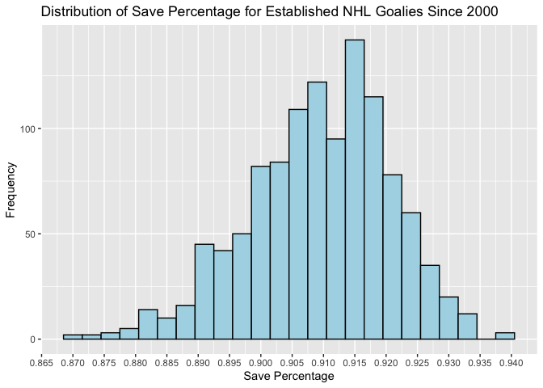

The Impact of Height on NHL Goalies (Exploratory Data Analysis)
================
Rayce Ramsay
2025-03-16

## Research Questions

The purpose of my research is to analyze the impact of height on a
goaltenders performance in the NHL. In particular:

1.  Have goalies in the NHL been getting shorter, taller, or no trend?
    Does this differ by country of origin?

2.  Do taller goalies in the NHL have more success (i.e. better SV% and
    GAA) than shorter goalies?

## Setup

``` r
# Load libraries
library(tidyverse)
library(cowplot)
library(ggcorrplot)
library(kableExtra)
```

## Data Loading

``` r
# Load data extracted from the NHL APIs (extraction done in separate file)
goalies = read_csv("../data/nhl_goalies_data.csv")
```

    ## Rows: 2256 Columns: 34
    ## ── Column specification ────────────────────────────────────────────────────────
    ## Delimiter: ","
    ## chr   (9): birthCity, birthCountryCode, birthStateProvinceCode, fullName, is...
    ## dbl  (24): draftOverall, draftRound, draftYear, height, playerId, weight, se...
    ## date  (1): birthDate
    ## 
    ## ℹ Use `spec()` to retrieve the full column specification for this data.
    ## ℹ Specify the column types or set `show_col_types = FALSE` to quiet this message.

``` r
prospects = read_csv("../data/nhl_goalie_prospects_data.csv")
```

    ## Rows: 869 Columns: 15
    ## ── Column specification ────────────────────────────────────────────────────────
    ## Delimiter: ","
    ## chr  (8): positionCode, catches, lastAmateurClub, lastAmateurLeague, birthCi...
    ## dbl  (5): height, weight, midtermRank, finalRank, draftYear
    ## lgl  (1): international
    ## date (1): birthDate
    ## 
    ## ℹ Use `spec()` to retrieve the full column specification for this data.
    ## ℹ Specify the column types or set `show_col_types = FALSE` to quiet this message.

``` r
# Check for import issues with NHL goalies data
dim(goalies)
```

    ## [1] 2256   34

``` r
head(goalies)
```

    ## # A tibble: 6 × 34
    ##   birthCity  birthCountryCode birthDate  birthStateProvinceCode draftOverall
    ##   <chr>      <chr>            <date>     <chr>                         <dbl>
    ## 1 Belleville CAN              1980-05-04 ON                              135
    ## 2 Riga       LVA              1967-02-02 <NA>                            196
    ## 3 Toronto    CAN              1965-01-14 ON                               69
    ## 4 Farmington USA              1977-03-12 MI                              129
    ## 5 Woonsocket USA              1977-01-02 RI                               22
    ## 6 Sussex     GBR              1971-02-25 <NA>                             35
    ## # ℹ 29 more variables: draftRound <dbl>, draftYear <dbl>, fullName <chr>,
    ## #   height <dbl>, isInHallOfFameYn <chr>, lastName <chr>,
    ## #   nationalityCode <chr>, playerId <dbl>, catches <chr>, weight <dbl>,
    ## #   seasonId <dbl>, assists <dbl>, gamesPlayed <dbl>, gamesStarted <dbl>,
    ## #   goals <dbl>, goalsAgainst <dbl>, goalsAgainstAverage <dbl>, losses <dbl>,
    ## #   otLosses <dbl>, penaltyMinutes <dbl>, points <dbl>, savePct <dbl>,
    ## #   saves <dbl>, shotsAgainst <dbl>, shutouts <dbl>, teamAbbrevs <chr>, …

``` r
tail(goalies)
```

    ## # A tibble: 6 × 34
    ##   birthCity      birthCountryCode birthDate  birthStateProvinceCode draftOverall
    ##   <chr>          <chr>            <date>     <chr>                         <dbl>
    ## 1 Surrey         CAN              1995-04-29 BC                               44
    ## 2 Espoo          FIN              1999-03-09 <NA>                             54
    ## 3 Helsinki       FIN              1995-02-06 <NA>                             94
    ## 4 Havlickuv Brod CZE              1996-01-09 <NA>                             39
    ## 5 Dollard-des-O… CAN              2000-03-04 QC                               NA
    ## 6 Omsk           RUS              2002-06-16 <NA>                             11
    ## # ℹ 29 more variables: draftRound <dbl>, draftYear <dbl>, fullName <chr>,
    ## #   height <dbl>, isInHallOfFameYn <chr>, lastName <chr>,
    ## #   nationalityCode <chr>, playerId <dbl>, catches <chr>, weight <dbl>,
    ## #   seasonId <dbl>, assists <dbl>, gamesPlayed <dbl>, gamesStarted <dbl>,
    ## #   goals <dbl>, goalsAgainst <dbl>, goalsAgainstAverage <dbl>, losses <dbl>,
    ## #   otLosses <dbl>, penaltyMinutes <dbl>, points <dbl>, savePct <dbl>,
    ## #   saves <dbl>, shotsAgainst <dbl>, shutouts <dbl>, teamAbbrevs <chr>, …

``` r
# Check for import issues with NHL goalie prospects data
dim(prospects)
```

    ## [1] 869  15

``` r
head(prospects)
```

    ## # A tibble: 6 × 15
    ##   positionCode catches height weight lastAmateurClub lastAmateurLeague
    ##   <chr>        <chr>    <dbl>  <dbl> <chr>           <chr>            
    ## 1 G            L           78    196 Brynas Jr.      SWEDEN-JR.       
    ## 2 G            L           74    220 Guelph          OHL              
    ## 3 G            L           74    215 Tri-City        WHL              
    ## 4 G            L           73    202 Tappara         FINLAND          
    ## 5 G            L           74    185 Lewiston        QMJHL            
    ## 6 G            L           78    220 Brynas          SWEDEN           
    ## # ℹ 9 more variables: birthDate <date>, birthCity <chr>,
    ## #   birthStateProvince <chr>, birthCountryCode <chr>, midtermRank <dbl>,
    ## #   finalRank <dbl>, draftYear <dbl>, international <lgl>, fullName <chr>

``` r
tail(prospects)
```

    ## # A tibble: 6 × 15
    ##   positionCode catches height weight lastAmateurClub lastAmateurLeague
    ##   <chr>        <chr>    <dbl>  <dbl> <chr>           <chr>            
    ## 1 G            L           74    172 BURLINGTON      OJHL             
    ## 2 G            L           73    185 USA U-18        NTDP - USHL      
    ## 3 G            R           72    176 WATERLOO        USHL             
    ## 4 G            L           74    172 BRUNSWICK PREP  HIGH-CT          
    ## 5 G            L           74    180 BRANTFORD       OHL              
    ## 6 G            L           76    182 RIMOUSKI        QMJHL            
    ## # ℹ 9 more variables: birthDate <date>, birthCity <chr>,
    ## #   birthStateProvince <chr>, birthCountryCode <chr>, midtermRank <dbl>,
    ## #   finalRank <dbl>, draftYear <dbl>, international <lgl>, fullName <chr>

Integer columns are being imported as doubles so I will explicitly set
the types for these columns. We could also convert some of the character
columns to factos. There doesn’t appear to be any import errors
otherwise. We have 2256 rows across 34 variables for the NHL goalies by
season data and 869 rows across 15 variables for the NHL goalie
prospects by draft year data.

``` r
# Convert the invalid double columns in the goalies data to integers and create some factors
goalies = goalies |>
  mutate(
    across(
      c(seasonId, playerId, height, weight, draftYear, draftRound, draftOverall, assists, 
        gamesPlayed, gamesStarted, goals, goalsAgainst, losses, otLosses, penaltyMinutes,
        points, saves, shotsAgainst, shutouts, ties, timeOnIce, wins),
      as.integer
    ),
    across(
      c(birthCountryCode, isInHallOfFameYn, catches),
      as.factor
    )
  )
```

``` r
# Convert the invalid double columns in the prospects data to integers and create some factors
prospects = prospects |>
  mutate(
    across(
      c(draftYear, height, weight, midtermRank, finalRank),
      as.integer
    ),
    across(
      c(positionCode, catches, birthCountryCode),
      as.factor
    )
  )
```

``` r
# Check the variable types in the goalies data
str(goalies)
```

    ## tibble [2,256 × 34] (S3: tbl_df/tbl/data.frame)
    ##  $ birthCity             : chr [1:2256] "Belleville" "Riga" "Toronto" "Farmington" ...
    ##  $ birthCountryCode      : Factor w/ 19 levels "AUT","BGR","BLR",..: 4 14 4 18 18 11 4 4 18 4 ...
    ##  $ birthDate             : Date[1:2256], format: "1980-05-04" "1967-02-02" ...
    ##  $ birthStateProvinceCode: chr [1:2256] "ON" NA "ON" "MI" ...
    ##  $ draftOverall          : int [1:2256] 135 196 69 129 22 35 122 54 85 169 ...
    ##  $ draftRound            : int [1:2256] 5 10 4 5 1 2 5 3 5 8 ...
    ##  $ draftYear             : int [1:2256] 1998 1989 1983 1995 1995 1989 1995 1991 1983 1991 ...
    ##  $ fullName              : chr [1:2256] "Andrew Raycroft" "Arturs Irbe" "Bob Essensa" "Brent Johnson" ...
    ##  $ height                : int [1:2256] 73 68 72 75 74 71 72 70 69 70 ...
    ##  $ isInHallOfFameYn      : Factor w/ 2 levels "N","Y": 1 1 1 1 1 1 1 1 1 1 ...
    ##  $ lastName              : chr [1:2256] "Raycroft" "Irbe" "Essensa" "Johnson" ...
    ##  $ nationalityCode       : chr [1:2256] "CAN" "LVA" "CAN" "USA" ...
    ##  $ playerId              : int [1:2256] 8467453 8456692 8446719 8462161 8462052 8455994 8462152 8458568 8451860 8458680 ...
    ##  $ catches               : Factor w/ 2 levels "L","R": 1 1 1 1 1 1 1 1 1 1 ...
    ##  $ weight                : int [1:2256] 180 190 188 199 200 185 198 180 170 170 ...
    ##  $ seasonId              : int [1:2256] 20002001 20002001 20002001 20002001 20002001 20002001 20002001 20002001 20002001 20002001 ...
    ##  $ assists               : int [1:2256] 0 2 0 0 0 2 0 0 0 0 ...
    ##  $ gamesPlayed           : int [1:2256] 15 83 41 33 28 45 1 58 18 1 ...
    ##  $ gamesStarted          : int [1:2256] 11 82 35 30 24 45 1 54 13 0 ...
    ##  $ goals                 : int [1:2256] 0 0 0 0 0 0 0 0 0 0 ...
    ##  $ goalsAgainst          : int [1:2256] 32 200 98 65 83 101 2 142 39 0 ...
    ##  $ goalsAgainstAverage   : num [1:2256] 2.96 2.52 2.7 2.16 3.31 ...
    ##  $ losses                : int [1:2256] 6 33 14 10 12 14 1 23 9 0 ...
    ##  $ otLosses              : int [1:2256] NA NA NA NA NA NA NA NA NA NA ...
    ##  $ penaltyMinutes        : int [1:2256] 0 10 4 2 2 6 0 8 2 0 ...
    ##  $ points                : int [1:2256] 0 2 0 0 0 2 0 0 0 0 ...
    ##  $ savePct               : num [1:2256] 0.89 0.907 0.893 0.909 0.874 ...
    ##  $ saves                 : int [1:2256] 259 1948 814 647 578 975 18 1326 333 8 ...
    ##  $ shotsAgainst          : int [1:2256] 291 2148 912 712 661 1076 20 1468 372 8 ...
    ##  $ shutouts              : int [1:2256] 0 6 1 4 1 2 0 2 0 0 ...
    ##  $ teamAbbrevs           : chr [1:2256] "BOS" "CAR" "VAN" "STL" ...
    ##  $ ties                  : int [1:2256] 0 9 3 2 5 7 0 4 2 0 ...
    ##  $ timeOnIce             : int [1:2256] 38918 285923 130849 108350 90373 152188 3515 191941 53761 1200 ...
    ##  $ wins                  : int [1:2256] 4 39 18 19 8 22 0 27 4 1 ...

``` r
# Check OT losses column
summary(goalies$otLosses)
```

    ##    Min. 1st Qu.  Median    Mean 3rd Qu.    Max.    NA's 
    ##   0.000   0.000   2.000   2.912   5.000  14.000     389

``` r
# Check the variable types in the prospects data
str(prospects)
```

    ## tibble [869 × 15] (S3: tbl_df/tbl/data.frame)
    ##  $ positionCode      : Factor w/ 1 level "G": 1 1 1 1 1 1 1 1 1 1 ...
    ##  $ catches           : Factor w/ 2 levels "L","R": 1 1 1 1 1 1 1 2 1 1 ...
    ##  $ height            : int [1:869] 78 74 74 73 74 78 73 74 74 74 ...
    ##  $ weight            : int [1:869] 196 220 215 202 185 220 200 183 190 186 ...
    ##  $ lastAmateurClub   : chr [1:869] "Brynas Jr." "Guelph" "Tri-City" "Tappara" ...
    ##  $ lastAmateurLeague : chr [1:869] "SWEDEN-JR." "OHL" "WHL" "FINLAND" ...
    ##  $ birthDate         : Date[1:869], format: "1990-01-31" "1989-12-07" ...
    ##  $ birthCity         : chr [1:869] "Gavle" "Amherst" "Moncton" "Toijala" ...
    ##  $ birthStateProvince: chr [1:869] NA "NY" "NB" NA ...
    ##  $ birthCountryCode  : Factor w/ 18 levels "BEL","BLR","CAN",..: 17 18 3 9 3 17 3 3 14 3 ...
    ##  $ midtermRank       : int [1:869] 2 3 1 NA 2 NA 9 18 NA NA ...
    ##  $ finalRank         : int [1:869] 1 1 2 2 3 3 4 5 5 6 ...
    ##  $ draftYear         : int [1:869] 2008 2008 2008 2008 2008 2008 2008 2008 2008 2008 ...
    ##  $ international     : logi [1:869] TRUE FALSE FALSE TRUE FALSE TRUE ...
    ##  $ fullName          : chr [1:869] "Jacob Markstrom" "Thomas McCollum" "Chet Pickard" "Harri Sateri" ...

We fixed issues with integers being cast as doubles. There appear to be
a lot NA’s in OT losses column but that’s okay since we won’t use it
anyways. There don’t appear to be any other major issues at the surface
level other than that.

## Data Manipulation

``` r
# Create column for checking whether a goalie was drafted or not
goalies = goalies |>
  mutate(
    drafted = !is.na(draftYear)
  )

class(goalies$drafted)
```

    ## [1] "logical"

``` r
table(goalies$drafted)
```

    ## 
    ## FALSE  TRUE 
    ##   377  1879

``` r
# Create column for goalie age as of the beginning of the season (i.e. September 15th as per NHL Hockey Operations Guidelines)
goalies = goalies |>
  separate(seasonId, into = c("seasonStartYear", "seasonEndYear"), sep = 4,
           convert = T, remove = F) |>
  mutate(
    ageAtSeasonStart = as.integer(
      interval(birthDate, date(paste0(seasonStartYear, "-09-15"))) / years()
    )
  )

class(goalies$ageAtSeasonStart)
```

    ## [1] "integer"

``` r
summary(goalies$ageAtSeasonStart)
```

    ##    Min. 1st Qu.  Median    Mean 3rd Qu.    Max. 
    ##   18.00   24.00   27.00   27.56   31.00   42.00

``` r
# Get the average goalie height minus 2 inches for every season
undersize_heights_per_season = goalies |>
  group_by(seasonId) |>
  summarize(
    undersize_threshold = mean(height) - 2
  ) |>
  ungroup()

# Create column classifying a goalie as undersized or not (i.e. <= 2" below average)
goalies = goalies |>
  left_join(undersize_heights_per_season, by = "seasonId") |>
  mutate(
    undersized = height <= undersize_threshold
  )

# View the effective threshold for being undersized each season
goalies |>
  filter(undersized) |>
  group_by(seasonId) |>
  summarize(
    effective_undersize_threshold = max(height)
  )
```

    ## # A tibble: 24 × 2
    ##    seasonId effective_undersize_threshold
    ##       <int>                         <int>
    ##  1 20002001                            70
    ##  2 20012002                            70
    ##  3 20022003                            70
    ##  4 20032004                            71
    ##  5 20052006                            71
    ##  6 20062007                            71
    ##  7 20072008                            71
    ##  8 20082009                            71
    ##  9 20092010                            71
    ## 10 20102011                            71
    ## # ℹ 14 more rows

``` r
class(goalies$undersized)
```

    ## [1] "logical"

``` r
table(goalies$undersized)
```

    ## 
    ## FALSE  TRUE 
    ##  1940   316

``` r
# Order goalies columns to view most important columns first
goalies = goalies |>
  relocate(
    seasonId, playerId, fullName, birthCountryCode, height, gamesPlayed, wins,
    savePct, goalsAgainstAverage, shotsAgainst, saves, goalsAgainst
  )
```

``` r
# Create column for prospect age as of the start of the next season (i.e. September 15th as per NHL Hockey Operations Guidelines)
prospects = prospects |>
  mutate(
    draftYearAge = as.integer(
      interval(birthDate, date(paste0(draftYear, "-09-15"))) / years()
    )
  )

class(prospects$draftYearAge)
```

    ## [1] "integer"

``` r
summary(prospects$draftYearAge)
```

    ##    Min. 1st Qu.  Median    Mean 3rd Qu.    Max. 
    ##   18.00   18.00   18.00   18.38   19.00   21.00

``` r
# Order prospects columns to view most important columns first
prospects = prospects |>
  relocate(
    draftYear, fullName, birthCountryCode, international, height, midtermRank, finalRank
  )
```

Adding the extra variables will help check the validity of the data with
respect to draft years, birth dates, and height classification.

## Variable Inspection

``` r
# Summarize the goalies data
summary(goalies)
```

    ##     seasonId           playerId         fullName         birthCountryCode
    ##  Min.   :20002001   Min.   :8445275   Length:2256        CAN    :987     
    ##  1st Qu.:20072008   1st Qu.:8467453   Class :character   USA    :442     
    ##  Median :20132014   Median :8471679   Mode  :character   FIN    :208     
    ##  Mean   :20128246   Mean   :8470700                      SWE    :183     
    ##  3rd Qu.:20192020   3rd Qu.:8476343                      CZE    :121     
    ##  Max.   :20242025   Max.   :8484312                      RUS    :108     
    ##                                                          (Other):207     
    ##      height       gamesPlayed         wins          savePct      
    ##  Min.   :67.00   Min.   : 1.00   Min.   : 0.00   Min.   :0.5000  
    ##  1st Qu.:73.00   1st Qu.: 7.00   1st Qu.: 2.00   1st Qu.:0.8930  
    ##  Median :74.00   Median :25.00   Median :10.00   Median :0.9069  
    ##  Mean   :73.93   Mean   :29.25   Mean   :13.32   Mean   :0.9010  
    ##  3rd Qu.:75.00   3rd Qu.:47.00   3rd Qu.:21.00   3rd Qu.:0.9169  
    ##  Max.   :79.00   Max.   :97.00   Max.   :57.00   Max.   :1.0000  
    ##                                                  NA's   :7       
    ##  goalsAgainstAverage  shotsAgainst        saves         goalsAgainst   
    ##  Min.   : 0.000      Min.   :   0.0   Min.   :   0.0   Min.   :  0.00  
    ##  1st Qu.: 2.420      1st Qu.: 178.0   1st Qu.: 160.5   1st Qu.: 18.00  
    ##  Median : 2.766      Median : 658.5   Median : 593.0   Median : 63.00  
    ##  Mean   : 2.882      Mean   : 810.4   Mean   : 737.0   Mean   : 73.38  
    ##  3rd Qu.: 3.177      3rd Qu.:1311.5   3rd Qu.:1190.2   3rd Qu.:120.00  
    ##  Max.   :27.273      Max.   :2668.0   Max.   :2497.0   Max.   :234.00  
    ##                                                                        
    ##   birthCity           birthDate          birthStateProvinceCode
    ##  Length:2256        Min.   :1962-08-23   Length:2256           
    ##  Class :character   1st Qu.:1978-05-24   Class :character      
    ##  Mode  :character   Median :1986-01-21   Mode  :character      
    ##                     Mean   :1985-04-20                         
    ##                     3rd Qu.:1992-02-14                         
    ##                     Max.   :2004-03-14                         
    ##                                                                
    ##   draftOverall      draftRound      draftYear    isInHallOfFameYn
    ##  Min.   :  1.00   Min.   : 1.00   Min.   :1981   N:2190          
    ##  1st Qu.: 37.00   1st Qu.: 2.00   1st Qu.:1997   Y:  66          
    ##  Median : 77.00   Median : 3.00   Median :2004                   
    ##  Mean   : 95.49   Mean   : 3.79   Mean   :2003                   
    ##  3rd Qu.:141.00   3rd Qu.: 5.00   3rd Qu.:2010                   
    ##  Max.   :291.00   Max.   :11.00   Max.   :2022                   
    ##  NA's   :377      NA's   :377     NA's   :377                    
    ##    lastName         nationalityCode    catches      weight      seasonStartYear
    ##  Length:2256        Length:2256        L:2080   Min.   :146.0   Min.   :2000   
    ##  Class :character   Class :character   R: 176   1st Qu.:188.0   1st Qu.:2007   
    ##  Mode  :character   Mode  :character            Median :200.0   Median :2013   
    ##                                                 Mean   :199.5   Mean   :2013   
    ##                                                 3rd Qu.:210.0   3rd Qu.:2019   
    ##                                                 Max.   :250.0   Max.   :2024   
    ##                                                                                
    ##  seasonEndYear     assists        gamesStarted      goals         
    ##  Min.   :2001   Min.   :0.0000   Min.   : 0.0   Min.   :0.000000  
    ##  1st Qu.:2008   1st Qu.:0.0000   1st Qu.: 6.0   1st Qu.:0.000000  
    ##  Median :2014   Median :0.0000   Median :22.0   Median :0.000000  
    ##  Mean   :2014   Mean   :0.6028   Mean   :27.2   Mean   :0.005762  
    ##  3rd Qu.:2020   3rd Qu.:1.0000   3rd Qu.:44.0   3rd Qu.:0.000000  
    ##  Max.   :2025   Max.   :8.0000   Max.   :97.0   Max.   :1.000000  
    ##                                                                   
    ##      losses         otLosses      penaltyMinutes       points      
    ##  Min.   : 0.00   Min.   : 0.000   Min.   : 0.000   Min.   :0.0000  
    ##  1st Qu.: 3.00   1st Qu.: 0.000   1st Qu.: 0.000   1st Qu.:0.0000  
    ##  Median : 9.00   Median : 2.000   Median : 0.000   Median :0.0000  
    ##  Mean   :10.91   Mean   : 2.912   Mean   : 2.408   Mean   :0.6086  
    ##  3rd Qu.:17.00   3rd Qu.: 5.000   3rd Qu.: 2.000   3rd Qu.:1.0000  
    ##  Max.   :42.00   Max.   :14.000   Max.   :39.000   Max.   :8.0000  
    ##                  NA's   :389                                       
    ##     shutouts      teamAbbrevs             ties          timeOnIce     
    ##  Min.   : 0.000   Length:2256        Min.   : 0.000   Min.   :     8  
    ##  1st Qu.: 0.000   Class :character   1st Qu.: 0.000   1st Qu.: 21650  
    ##  Median : 1.000   Mode  :character   Median : 2.000   Median : 80926  
    ##  Mean   : 1.737                      Mean   : 3.385   Mean   : 98797  
    ##  3rd Qu.: 3.000                      3rd Qu.: 6.000   3rd Qu.:157964  
    ##  Max.   :16.000                      Max.   :14.000   Max.   :351895  
    ##                                      NA's   :1885                     
    ##   drafted        ageAtSeasonStart undersize_threshold undersized     
    ##  Mode :logical   Min.   :18.00    Min.   :70.41       Mode :logical  
    ##  FALSE:377       1st Qu.:24.00    1st Qu.:71.26       FALSE:1940     
    ##  TRUE :1879      Median :27.00    Median :72.17       TRUE :316      
    ##                  Mean   :27.56    Mean   :71.93                      
    ##                  3rd Qu.:31.00    3rd Qu.:72.57                      
    ##                  Max.   :42.00    Max.   :73.03                      
    ## 

It appears most variables in the goalies data have reasonable values,
although there are some potential issues (i.e. with height, time on ice,
and save percentage):

- The age range of 18-42 years old makes sense given that NHL players
  need to be at least 18 years old and many stop playing before their
  forties (although some do - the oldest active NHL goalie is 40).

- The heights of goalies ranges from 67-79 inches or 5’7”-6’7”. This is
  a reasonable range, although I will have to confirm 5’7” is accurate
  given this is considered extremely undersized for an NHL goalie.

- There are 377 NA’s in each of the draft variables. This makes sense
  given that you can make the NHL without being selected in the NHL
  Entry Draft (although it is definitely more rare). For further
  comfort, each of `draftYear`, `draftRound`, and `draftOverall` have
  exactly the same number of NA’s which is a good sign that `drafted` is
  encoded properly since being undrafted means all 3 of these variables
  should be empty.

- The maximum number of games that can be played in a single season
  (including regular season and playoffs) is 110 so the range of 1-97
  for games played and 0-57 for wins makes sense, further validating the
  data.

- Goals against average (GAA) appears to have a reasonable range,
  although there is definitely a point of interest with the value 27.273
  (this is extremely high, although possible due to how GAA is
  calculated).

- Time on ice (measured in seconds) indicates that someone only played 8
  seconds in an entire season. This likely indicates an emergency backup
  situation or something similar and thus, needs investigation.

- Save percentage (SV%) has 7 missing values. This could indicate a
  goalie who faced 0 shots, likely indicating an emergency backup
  situation. This also needs further investigation.

``` r
# Investigate 5'7" goalie (and other goalies under 5'10" = 70")
goalies |>
  filter(height < 70) |>
  select(seasonId, fullName, height) |>
  arrange(height, fullName, seasonId)
```

    ## # A tibble: 27 × 3
    ##    seasonId fullName        height
    ##       <int> <chr>            <int>
    ##  1 20002001 Fred Brathwaite     67
    ##  2 20012002 Fred Brathwaite     67
    ##  3 20022003 Fred Brathwaite     67
    ##  4 20032004 Fred Brathwaite     67
    ##  5 20112012 Shawn Hunwick       67
    ##  6 20002001 Arturs Irbe         68
    ##  7 20012002 Arturs Irbe         68
    ##  8 20022003 Arturs Irbe         68
    ##  9 20032004 Arturs Irbe         68
    ## 10 20002001 Glenn Healy         68
    ## # ℹ 17 more rows

After verifying these goalies with external sources, all of their
heights are valid.

``` r
# Investigate missing save percentages
goalies |>
  filter(is.na(savePct)) |>
  relocate(seasonId, fullName, savePct, shotsAgainst, timeOnIce) |>
  arrange(seasonId, fullName)
```

    ## # A tibble: 7 × 40
    ##   seasonId fullName     savePct shotsAgainst timeOnIce playerId birthCountryCode
    ##      <int> <chr>          <dbl>        <int>     <int>    <int> <fct>           
    ## 1 20002001 Evgeny Kons…      NA            0        24  8467940 RUS             
    ## 2 20052006 Jordan Siga…      NA            0        43  8469653 CAN             
    ## 3 20052006 Robert McVi…      NA            0       164  8469750 CAN             
    ## 4 20112012 Jake Allen        NA            0        67  8474596 CAN             
    ## 5 20112012 Shawn Hunwi…      NA            0       153  8476803 USA             
    ## 6 20162017 Jorge Alves       NA            0         8  8479115 USA             
    ## 7 20222023 Jett Alexan…      NA            0        70  8483183 CAN             
    ## # ℹ 33 more variables: height <int>, gamesPlayed <int>, wins <int>,
    ## #   goalsAgainstAverage <dbl>, saves <int>, goalsAgainst <int>,
    ## #   birthCity <chr>, birthDate <date>, birthStateProvinceCode <chr>,
    ## #   draftOverall <int>, draftRound <int>, draftYear <int>,
    ## #   isInHallOfFameYn <fct>, lastName <chr>, nationalityCode <chr>,
    ## #   catches <fct>, weight <int>, seasonStartYear <int>, seasonEndYear <int>,
    ## #   assists <int>, gamesStarted <int>, goals <int>, losses <int>, …

After investigating the 7 observations with missing save percentages, I
found the following:

- Evgeny Konstantinov was a goalie drafted by Tampa Bay but only
  appeared in 2 NHL games throughout his career. There is no indication,
  however, that this was an emergency backup situation.

- Jordan Sigalet was a professional goalie whose career was cut short
  due to his battle with MS. He played many games in the AHL, indicating
  his one game in the NHL was due to skill rather than an emergency
  scenerio.

- Robert McVicar was a professional goalie who was called up a dozen or
  so times during the 2005-2006 season. While he never faced a shot, he
  was on the team based off merit.

- Jake Allen is a current goalie in the NHL and has been for over a
  decade.

- Shawn Hunwick was an emergency backup for a couple of days in 2012
  when Columbus was facing sudden injury problems (hence the 2:33 of ice
  time).

- Jorge Alves was an equipment manager for Carolina and also backed up
  for one game due to emergency injury trouble.

- Jett Alexander was an emergency backup for one game with Toronto due
  to injury troubles on the team. The coach put him in for the last 70
  seconds of a game they were winning 7-1. As a fun aside, I played with
  Jett that year and was in the stands for this game as an emergency
  backup.

I don’t want to keep goalies in the data that only played once and never
again due to emergency scenerios. This is because in emergency
situations teams usually grab the goalie who is most available, rather
than picking a goalie from their system or farm team that is the next
best in line. Keeping these observations would take away from the
quality of my analysis so my objective is to rid them where possible.
Therefore, I will remove the 3 observations deemed as emergency backups.
It should be noted that there are only 6 times an emergency backup has
played, so I will manually identify and remove the rest of these
observations as well.

``` r
# Find emergency situation goalies
emergency_goalies = goalies |>
  filter (fullName %in% c("Shawn Hunwick", "Jorge Alves", "Jett Alexander",
                          "Thomas Hodges", "Matthew Berlin", "Scott Foster"))

emergency_goalies
```

    ## # A tibble: 6 × 40
    ##   seasonId playerId fullName   birthCountryCode height gamesPlayed  wins savePct
    ##      <int>    <int> <chr>      <fct>             <int>       <int> <int>   <dbl>
    ## 1 20112012  8476803 Shawn Hun… USA                  67           1     0  NA    
    ## 2 20162017  8479115 Jorge Alv… USA                  69           1     0  NA    
    ## 3 20172018  8479138 Scott Fos… CAN                  72           1     0   1    
    ## 4 20212022  8480591 Thomas Ho… GBR                  70           1     0   0.667
    ## 5 20222023  8483183 Jett Alex… CAN                  77           1     0  NA    
    ## 6 20222023  8483158 Matthew B… CAN                  75           1     0   1    
    ## # ℹ 32 more variables: goalsAgainstAverage <dbl>, shotsAgainst <int>,
    ## #   saves <int>, goalsAgainst <int>, birthCity <chr>, birthDate <date>,
    ## #   birthStateProvinceCode <chr>, draftOverall <int>, draftRound <int>,
    ## #   draftYear <int>, isInHallOfFameYn <fct>, lastName <chr>,
    ## #   nationalityCode <chr>, catches <fct>, weight <int>, seasonStartYear <int>,
    ## #   seasonEndYear <int>, assists <int>, gamesStarted <int>, goals <int>,
    ## #   losses <int>, otLosses <int>, penaltyMinutes <int>, points <int>, …

``` r
# Remove emergency goalies from data
goalies = goalies |>
  anti_join(emergency_goalies, by = "playerId")

nrow(goalies)
```

    ## [1] 2250

``` r
# Investigate limited time on ice
summary(goalies$timeOnIce)
```

    ##    Min. 1st Qu.  Median    Mean 3rd Qu.    Max. 
    ##      24   21832   81109   99060  158218  351895

``` r
# Investigate the goalies who played less than a minute
goalies |>
  filter(timeOnIce < 60)
```

    ## # A tibble: 2 × 40
    ##   seasonId playerId fullName   birthCountryCode height gamesPlayed  wins savePct
    ##      <int>    <int> <chr>      <fct>             <int>       <int> <int>   <dbl>
    ## 1 20002001  8467940 Evgeny Ko… RUS                  72           1     0      NA
    ## 2 20052006  8469653 Jordan Si… CAN                  73           1     0      NA
    ## # ℹ 32 more variables: goalsAgainstAverage <dbl>, shotsAgainst <int>,
    ## #   saves <int>, goalsAgainst <int>, birthCity <chr>, birthDate <date>,
    ## #   birthStateProvinceCode <chr>, draftOverall <int>, draftRound <int>,
    ## #   draftYear <int>, isInHallOfFameYn <fct>, lastName <chr>,
    ## #   nationalityCode <chr>, catches <fct>, weight <int>, seasonStartYear <int>,
    ## #   seasonEndYear <int>, assists <int>, gamesStarted <int>, goals <int>,
    ## #   losses <int>, otLosses <int>, penaltyMinutes <int>, points <int>, …

We have already discussed these goalies. Since we already removed
goalies who played due to emergency circumstances, there is no further
action needed.

``` r
# Summarize prospects data
summary(prospects)
```

    ##    draftYear      fullName         birthCountryCode international  
    ##  Min.   :2008   Length:869         CAN    :366      Mode :logical  
    ##  1st Qu.:2013   Class :character   USA    :198      FALSE:640      
    ##  Median :2017   Mode  :character   SWE    : 64      TRUE :229      
    ##  Mean   :2017                      CZE    : 57                     
    ##  3rd Qu.:2021                      FIN    : 56                     
    ##  Max.   :2025                      RUS    : 47                     
    ##                                    (Other): 81                     
    ##      height      midtermRank       finalRank     positionCode catches
    ##  Min.   :67.0   Min.   :  1.00   Min.   : 1.00   G:869        L:799  
    ##  1st Qu.:73.0   1st Qu.:  6.00   1st Qu.: 6.00                R: 70  
    ##  Median :74.0   Median : 12.00   Median :11.00                       
    ##  Mean   :74.1   Mean   : 15.28   Mean   :13.45                       
    ##  3rd Qu.:75.0   3rd Qu.: 21.25   3rd Qu.:21.00                       
    ##  Max.   :80.0   Max.   :999.00   Max.   :35.00                       
    ##                 NA's   :173      NA's   :162                         
    ##      weight      lastAmateurClub    lastAmateurLeague    birthDate         
    ##  Min.   :150.0   Length:869         Length:869         Min.   :1988-01-05  
    ##  1st Qu.:180.0   Class :character   Class :character   1st Qu.:1994-06-22  
    ##  Median :190.0   Mode  :character   Mode  :character   Median :1998-10-29  
    ##  Mean   :190.6                                         Mean   :1998-10-01  
    ##  3rd Qu.:200.0                                         3rd Qu.:2002-12-20  
    ##  Max.   :248.0                                         Max.   :2007-09-10  
    ##                                                                            
    ##   birthCity         birthStateProvince  draftYearAge  
    ##  Length:869         Length:869         Min.   :18.00  
    ##  Class :character   Class :character   1st Qu.:18.00  
    ##  Mode  :character   Mode  :character   Median :18.00  
    ##                                        Mean   :18.38  
    ##                                        3rd Qu.:19.00  
    ##                                        Max.   :21.00  
    ## 

``` r
# Compare number of NAs in final rankings to number of 2025 prospects
prospects |>
  filter(draftYear == 2025) |>
  mutate(total = n()) |>
  select(total, draftYear, midtermRank, finalRank) |>
  summary()
```

    ##      total      draftYear     midtermRank      finalRank  
    ##  Min.   :48   Min.   :2025   Min.   : 1.00   Min.   : NA  
    ##  1st Qu.:48   1st Qu.:2025   1st Qu.: 6.75   1st Qu.: NA  
    ##  Median :48   Median :2025   Median :12.50   Median : NA  
    ##  Mean   :48   Mean   :2025   Mean   :13.83   Mean   :NaN  
    ##  3rd Qu.:48   3rd Qu.:2025   3rd Qu.:20.25   3rd Qu.: NA  
    ##  Max.   :48   Max.   :2025   Max.   :32.00   Max.   : NA  
    ##                                              NA's   :48

It appears most variables in the prospects data have reasonable values,
although there might be an issue with midterm rank. Notable thoughts are
as follows:

- Draft year has the correct range from 2008 to 2025 as these are the
  only years available from the API.

- The heights of prospects are reasonable, ranging from 67 to 80 inches
  (5’7” to 6’8”).

- Prospects eligible for the NHL Entry Draft must be between 18 and 21
  years old by the time the season starts, which is reflected properly
  in the `draftYearAge` variable.

- Mid-season and end-of-season (i.e. midterm and final) rankings have
  some missing values. This is expected since the API doesn’t return a
  value for goalies who were unranked. Additionally, since the final
  season rankings have not been released yet, every final ranking value
  is NA for the year 2025.

- Midterm rank has an unusual max of 999. This needs investigation as
  most of the time only 30ish goalies are ranked for each of North
  American and International categories.

``` r
# Investigate midterm rank of 999
prospects |>
  filter(midtermRank > 50)
```

    ## # A tibble: 1 × 16
    ##   draftYear fullName birthCountryCode international height midtermRank finalRank
    ##       <int> <chr>    <fct>            <lgl>          <int>       <int>     <int>
    ## 1      2009 Connor … USA              FALSE             77         999        19
    ## # ℹ 9 more variables: positionCode <fct>, catches <fct>, weight <int>,
    ## #   lastAmateurClub <chr>, lastAmateurLeague <chr>, birthDate <date>,
    ## #   birthCity <chr>, birthStateProvince <chr>, draftYearAge <int>

After further investigation on the official NHL website, the value of
999 likely indicates that scouts only got to view this goalie play a
limited number of times. However, he is still considered unranked at the
time of midterm rankings.

## Summary Statistics and Visualizations

``` r
# Explore distribution of goalie heights
goalies |>
  ggplot(aes(height)) +
  geom_histogram(binwidth = 1, color = "black", fill = "lightblue") +
  scale_x_continuous(breaks = 67:79) +
  labs(
    title = "Distribution of NHL Goalie Heights Since 2000",
    x = "Height (in)",
    y = "Frequency"
  )
```

<!-- -->

``` r
# Get average goalie heights in the NHL over the past 25 years
goalie_heights_per_season = goalies |>
  group_by(seasonStartYear, seasonEndYear) |>
  summarize(
    n = n(),
    min_height = min(height),
    mean_height = mean(height),
    median_height = median(height),
    max_height = max(height)
  ) |>
  ungroup() |>
  arrange(seasonStartYear)
```

    ## `summarise()` has grouped output by 'seasonStartYear'. You can override using
    ## the `.groups` argument.

``` r
goalie_heights_per_season
```

    ## # A tibble: 24 × 7
    ##    seasonStartYear seasonEndYear     n min_height mean_height median_height
    ##              <int>         <int> <int>      <int>       <dbl>         <dbl>
    ##  1            2000          2001    91         67        72.4            73
    ##  2            2001          2002    90         67        72.5            73
    ##  3            2002          2003    94         67        72.7            73
    ##  4            2003          2004    96         67        73.0            73
    ##  5            2005          2006    93         70        73.3            73
    ##  6            2006          2007    84         70        73.2            73
    ##  7            2007          2008    90         70        73.3            73
    ##  8            2008          2009    91         70        73.5            73
    ##  9            2009          2010    84         70        73.5            73
    ## 10            2010          2011    89         70        73.8            74
    ## # ℹ 14 more rows
    ## # ℹ 1 more variable: max_height <int>

``` r
# Plot NHL goalie heights over time

# Mean height
goalie_heights_per_season |>
  ggplot(aes(x = seasonStartYear, y = mean_height)) +
  geom_line(color="lightblue") +
  geom_point(color="#000099") +
  theme_minimal() +
  labs(
    title = "Average Height of NHL Goalies by Season",
    x = "Season",
    y = "Average Height"
  ) +
  scale_x_continuous(
    breaks = seq(2000, 2024, 2),
    labels = paste(str_pad(seq(0, 24, 2), 2, pad = "0"), str_pad(seq(1, 25, 2), 2, pad = "0"), sep = "-")
  ) +
  scale_y_continuous(
    breaks = 60:83,
    labels = c(paste0("5'", 0:11, '"'), paste0("6'", 0:11, '"'))
  )
```

<!-- -->

``` r
# Min height
goalie_heights_per_season |>
  ggplot(aes(x = seasonStartYear, y = min_height)) +
  geom_line(color="lightblue") +
  geom_point(color="#000099") +
  theme_minimal() +
  labs(
    title = "Minimum Height of NHL Goalies by Season",
    x = "Season",
    y = "Minimum Height"
  ) +
  scale_x_continuous(
    breaks = seq(2000, 2024, 2),
    labels = paste(str_pad(seq(0, 24, 2), 2, pad = "0"), str_pad(seq(1, 25, 2), 2, pad = "0"), sep = "-")
  ) +
  scale_y_continuous(
    breaks = 60:83,
    labels = c(paste0("5'", 0:11, '"'), paste0("6'", 0:11, '"'))
  )
```

<!-- -->

``` r
# Median height
goalie_heights_per_season |>
  ggplot(aes(x = seasonStartYear, y = median_height)) +
  geom_line(color="lightblue") +
  geom_point(color="#000099") +
  theme_minimal() +
  labs(
    title = "Median Height of NHL Goalies by Season",
    x = "Season",
    y = "Median Height"
  ) +
  scale_x_continuous(
    breaks = seq(2000, 2024, 2),
    labels = paste(str_pad(seq(0, 24, 2), 2, pad = "0"), str_pad(seq(1, 25, 2), 2, pad = "0"), sep = "-")
  ) +
  scale_y_continuous(
    breaks = 60:83,
    labels = c(paste0("5'", 0:11, '"'), paste0("6'", 0:11, '"'))
  )
```

<!-- -->

``` r
# Max height
goalie_heights_per_season |>
  ggplot(aes(x = seasonStartYear, y = max_height)) +
  geom_line(color="lightblue") +
  geom_point(color="#000099") +
  theme_minimal() +
  labs(
    title = "Maximum Height of NHL Goalies by Season",
    x = "Season",
    y = "Maximum Height"
  ) +
  scale_x_continuous(
    breaks = seq(2000, 2024, 2),
    labels = paste(str_pad(seq(0, 24, 2), 2, pad = "0"), str_pad(seq(1, 25, 2), 2, pad = "0"), sep = "-")
  ) +
  scale_y_continuous(
    breaks = 60:83,
    labels = c(paste0("5'", 0:11, '"'), paste0("6'", 0:11, '"'))
  )
```

<!-- -->

``` r
# Explore correlation between physical attributes and time
goalies |>
  select(seasonStartYear, height, weight) |>
  cor() |>
  ggcorrplot(lab = T, title = "Correlation Between Physical Attributes and\nTime of NHL Goalies")
```

<!-- -->

It appears that NHL goalies have been trending taller over the past 25
years. The mean height has consistently increased from about 72.4 inches
to just over 75 inches. Similarly, the minimum height has risen from 67
inches to 71 inches, median from 73 inches to 75 inches, and maximum
from 76 to 79 inches. It is worth noting that the minimum and maximum
don’t necessarily mean much since there could be one very small/big
goalie who stays in the league for multiple seasons. However, the upward
trend in mean height and moderately strong correlation coefficient of
0.39 between height and season is indicative of NHL goalies getting
bigger. On top of this, there hasn’t been a goalie under 5’11” in the
past 6 seasons.

``` r
# Check how many observations are considered established
established_goalies = goalies |>
  filter(gamesPlayed >= 25 | (gamesPlayed >= 22 & seasonStartYear == 2024))

established_goalies |>
  summarize(
    n = n(),
    prop_of_goalies = n() / nrow(goalies),
    prop_of_shots_against = sum(shotsAgainst) / sum(goalies$shotsAgainst),
    prop_of_goals_against = sum(goalsAgainst) / sum(goalies$goalsAgainst),
    prop_of_time_on_ice = sum(timeOnIce) / sum(goalies$timeOnIce)
  )
```

    ## # A tibble: 1 × 5
    ##       n prop_of_goalies prop_of_shots_against prop_of_goals_against
    ##   <int>           <dbl>                 <dbl>                 <dbl>
    ## 1  1146           0.509                 0.854                 0.839
    ## # ℹ 1 more variable: prop_of_time_on_ice <dbl>

Approximately 51% of the goalies data includes “established” goalies
i.e. goalies who played at least 25 games (or 22 for the current 2024-25
season). This threshold comes from the default filter for stat leaders
on NHL.com. Around 85% of the shots faced and 84% of goals allowed in
the NHL since 2000 have been against established goalies. This makes
sense given that established goalies also make up around 85% of the time
played in the data.

``` r
# Get average goalie heights of established goalies in the NHL over the past 25 years
established_goalie_heights_per_season = established_goalies |>
  group_by(seasonStartYear, seasonEndYear) |>
  summarize(
    n = n(),
    min_height = min(height),
    mean_height = mean(height),
    median_height = median(height),
    max_height = max(height),
    .groups = "drop"
  ) |>
  ungroup() |>
  arrange(seasonStartYear)

established_goalie_heights_per_season
```

    ## # A tibble: 24 × 7
    ##    seasonStartYear seasonEndYear     n min_height mean_height median_height
    ##              <int>         <int> <int>      <int>       <dbl>         <dbl>
    ##  1            2000          2001    48         67        72.4            73
    ##  2            2001          2002    45         67        72.7            73
    ##  3            2002          2003    42         67        72.8            73
    ##  4            2003          2004    45         70        73.0            73
    ##  5            2005          2006    52         70        73.1            73
    ##  6            2006          2007    44         70        73              73
    ##  7            2007          2008    44         70        73.2            73
    ##  8            2008          2009    47         70        73.2            73
    ##  9            2009          2010    47         70        73.6            74
    ## 10            2010          2011    49         71        73.7            74
    ## # ℹ 14 more rows
    ## # ℹ 1 more variable: max_height <int>

``` r
# Plot NHL goalies heights over time for goalies with at least 25 games played (22 for current season)

# Mean height
established_goalie_heights_per_season |>
  ggplot(aes(x = seasonStartYear, y = mean_height)) +
  geom_line(color="lightblue") +
  geom_point(color="#000099") +
  theme_minimal() +
  labs(
    title = "Average Height of NHL Goalies by Season (Minimum 25 Games Played)",
    x = "Season",
    y = "Average Height"
  ) +
  scale_x_continuous(
    breaks = seq(2000, 2024, 2),
    labels = paste(str_pad(seq(0, 24, 2), 2, pad = "0"), str_pad(seq(1, 25, 2), 2, pad = "0"), sep = "-")
  ) +
  scale_y_continuous(
    breaks = 60:83,
    labels = c(paste0("5'", 0:11, '"'), paste0("6'", 0:11, '"'))
  )
```

<!-- -->

``` r
# Min height
established_goalie_heights_per_season |>
  ggplot(aes(x = seasonStartYear, y = min_height)) +
  geom_line(color="lightblue") +
  geom_point(color="#000099") +
  theme_minimal() +
  labs(
    title = "Minimum Height of Established NHL Goalies by Season",
    x = "Season",
    y = "Minimum Height"
  ) +
  scale_x_continuous(
    breaks = seq(2000, 2024, 2),
    labels = paste(str_pad(seq(0, 24, 2), 2, pad = "0"), str_pad(seq(1, 25, 2), 2, pad = "0"), sep = "-")
  ) +
  scale_y_continuous(
    breaks = 60:83,
    labels = c(paste0("5'", 0:11, '"'), paste0("6'", 0:11, '"'))
  )
```

<!-- -->

``` r
# Median height
established_goalie_heights_per_season |>
  ggplot(aes(x = seasonStartYear, y = median_height)) +
  geom_line(color="lightblue") +
  geom_point(color="#000099") +
  theme_minimal() +
  labs(
    title = "Median Height of Established NHL Goalies by Season",
    x = "Season",
    y = "Median Height"
  ) +
  scale_x_continuous(
    breaks = seq(2000, 2024, 2),
    labels = paste(str_pad(seq(0, 24, 2), 2, pad = "0"), str_pad(seq(1, 25, 2), 2, pad = "0"), sep = "-")
  ) +
  scale_y_continuous(
    breaks = 60:83,
    labels = c(paste0("5'", 0:11, '"'), paste0("6'", 0:11, '"'))
  )
```

<!-- -->

``` r
# Max height
established_goalie_heights_per_season |>
  ggplot(aes(x = seasonStartYear, y = max_height)) +
  geom_line(color="lightblue") +
  geom_point(color="#000099") +
  theme_minimal() +
  labs(
    title = "Maximum Height of Established NHL Goalies by Season",
    x = "Season",
    y = "Maximum Height"
  ) +
  scale_x_continuous(
    breaks = seq(2000, 2024, 2),
    labels = paste(str_pad(seq(0, 24, 2), 2, pad = "0"), str_pad(seq(1, 25, 2), 2, pad = "0"), sep = "-")
  ) +
  scale_y_continuous(
    breaks = 60:83,
    labels = c(paste0("5'", 0:11, '"'), paste0("6'", 0:11, '"'))
  )
```

<!-- -->

The results for established goalies follow the same upward trend in
height as all goalies. This means the results seen earlier are not
influenced by call-ups who are only in the league for a couple of games.

``` r
# Get the top 5 NHL goalie producing countries in each season
goalie_counts_by_country_and_season = goalies |>
  group_by(seasonStartYear, seasonEndYear, birthCountryCode) |>
  summarize(n = n(), .groups = "drop_last") |>
  slice_max(n, n = 5, with_ties = F) |>
  ungroup() |>
  arrange(seasonStartYear, -n)

goalie_counts_by_country_and_season
```

    ## # A tibble: 120 × 4
    ##    seasonStartYear seasonEndYear birthCountryCode     n
    ##              <int>         <int> <fct>            <int>
    ##  1            2000          2001 CAN                 55
    ##  2            2000          2001 USA                 15
    ##  3            2000          2001 CZE                  5
    ##  4            2000          2001 FIN                  3
    ##  5            2000          2001 SWE                  3
    ##  6            2001          2002 CAN                 52
    ##  7            2001          2002 USA                 13
    ##  8            2001          2002 CZE                  6
    ##  9            2001          2002 FIN                  6
    ## 10            2001          2002 SWE                  3
    ## # ℹ 110 more rows

``` r
# Plot the top 5 goalie countries
goalie_counts_by_country_and_season |>
  filter(seasonStartYear >= 2005) |>
  ggplot(aes(x = seasonStartYear, y = n, fill = reorder(birthCountryCode, -n))) +
  geom_bar(stat = "identity", position = "dodge", width = 0.8) +
  labs(
    title = "Top 5 Birth Countries of NHL Goalies by Season",
    x = "Season",
    y = "Count",
    legend = "Country"
  ) +
  scale_x_continuous(
    breaks = seq(2000, 2024, 2),
    labels = paste(str_pad(seq(0, 24, 2), 2, pad = "0"), str_pad(seq(1, 25, 2), 2, pad = "0"), sep = "-")
  ) +
  scale_fill_brewer("Country", palette = "Set1")
```

<!-- -->

``` r
# Get average goalie heights in the NHL over the past 25 years by country
goalie_heights_per_season_country = goalies |>
  filter(birthCountryCode %in% c("CAN", "USA", "SWE", "FIN")) |>
  group_by(seasonStartYear, seasonEndYear, birthCountryCode) |>
  summarize(
    n = n(),
    min_height = min(height),
    mean_height = mean(height),
    median_height = median(height),
    max_height = max(height),
    .groups = "drop"
  ) |>
  ungroup() |>
  arrange(birthCountryCode, seasonStartYear)

goalie_heights_per_season_country
```

    ## # A tibble: 96 × 8
    ##    seasonStartYear seasonEndYear birthCountryCode     n min_height mean_height
    ##              <int>         <int> <fct>            <int>      <int>       <dbl>
    ##  1            2000          2001 CAN                 55         67        72.3
    ##  2            2001          2002 CAN                 52         67        72.4
    ##  3            2002          2003 CAN                 53         67        72.6
    ##  4            2003          2004 CAN                 55         67        73.0
    ##  5            2005          2006 CAN                 49         70        73.1
    ##  6            2006          2007 CAN                 43         70        73.2
    ##  7            2007          2008 CAN                 45         70        73.2
    ##  8            2008          2009 CAN                 45         70        73.6
    ##  9            2009          2010 CAN                 42         70        73.7
    ## 10            2010          2011 CAN                 42         70        73.7
    ## # ℹ 86 more rows
    ## # ℹ 2 more variables: median_height <dbl>, max_height <int>

``` r
# Plot NHL goalie heights by country over time

# Mean height
goalie_heights_per_season_country |>
  ggplot(aes(x = seasonStartYear, y = mean_height, colour = birthCountryCode)) +
  geom_line() +
  geom_point() +
  facet_wrap(~birthCountryCode) +
  theme_minimal() +
  labs(
    title = "Average Height of NHL Goalies by Season and Birth Country",
    x = "Season",
    y = "Average Height",
    colour = "Country"
  ) +
  scale_x_continuous(
    breaks = seq(2000, 2024, 6),
    labels = paste0("'", str_pad(seq(0, 24, 6), 2, pad = "0"))
  ) +
  scale_y_continuous(
    breaks = 60:83,
    labels = c(paste0("5'", 0:11, '"'), paste0("6'", 0:11, '"'))
  )
```

<!-- -->

``` r
# Min height
goalie_heights_per_season_country |>
  ggplot(aes(x = seasonStartYear, y = min_height, colour = birthCountryCode)) +
  geom_line() +
  geom_point() +
  facet_wrap(~birthCountryCode) +
  theme_minimal() +
  labs(
    title = "Minimum Height of NHL Goalies by Season and Birth Country",
    x = "Season",
    y = "Minimum Height",
    colour = "Country"
  ) +
  scale_x_continuous(
    breaks = seq(2000, 2024, 6),
    labels = paste0("'", str_pad(seq(0, 24, 6), 2, pad = "0"))
  ) +
  scale_y_continuous(
    breaks = 60:83,
    labels = c(paste0("5'", 0:11, '"'), paste0("6'", 0:11, '"'))
  )
```

<!-- -->

``` r
# Median height
goalie_heights_per_season_country |>
  ggplot(aes(x = seasonStartYear, y = median_height, colour = birthCountryCode)) +
  geom_line() +
  geom_point() +
  facet_wrap(~birthCountryCode) +
  theme_minimal() +
  labs(
    title = "Median Height of NHL Goalies by Season and Birth Country",
    x = "Season",
    y = "Median Height",
    colour = "Country"
  ) +
  scale_x_continuous(
    breaks = seq(2000, 2024, 6),
    labels = paste0("'", str_pad(seq(0, 24, 6), 2, pad = "0"))
  ) +
  scale_y_continuous(
    breaks = 60:83,
    labels = c(paste0("5'", 0:11, '"'), paste0("6'", 0:11, '"'))
  )
```

<!-- -->

``` r
# Max height
goalie_heights_per_season_country |>
  ggplot(aes(x = seasonStartYear, y = max_height, colour = birthCountryCode)) +
  geom_line() +
  geom_point() +
  facet_wrap(~birthCountryCode) +
  theme_minimal() +
  labs(
    title = "Maximum Height of NHL Goalies by Season and Birth Country",
    x = "Season",
    y = "Maximum Height",
    colour = "Country"
  ) +
  scale_x_continuous(
    breaks = seq(2000, 2024, 6),
    labels = paste0("'", str_pad(seq(0, 24, 6), 2, pad = "0"))
  ) +
  scale_y_continuous(
    breaks = 60:83,
    labels = c(paste0("5'", 0:11, '"'), paste0("6'", 0:11, '"'))
  )
```

<!-- -->

After filtering the data to only include the top 4 NHL goalie producing
countries Canada, United States, Sweden, and Finland, the upward trend
in height is exhibited across all 4 nations. While Canada and Finland’s
averages are currently around 6’3”, the average is slightly lower for
the United States at 6’2.5” and considerably higher for Sweden just
below 6’4.5”.

``` r
# Explore distribution of ranked NHL goalie prospects heights
prospects |>
  ggplot(aes(height)) +
  geom_histogram(binwidth = 1, color = "black", fill = "lightblue") +
  scale_x_continuous(breaks = 67:79) +
  labs(
    title = "Distribution of Ranked NHL Goalie Prospect Heights Since 2008",
    x = "Height (in)",
    y = "Frequency"
  )
```

<!-- -->

``` r
# Get average heights of ranked NHL goalie prospects by draft year
prospect_heights_per_season = prospects |>
  group_by(draftYear) |>
  summarize(
    n = n(),
    min_height = min(height),
    mean_height = mean(height),
    median_height = median(height),
    max_height = max(height)
  ) |>
  ungroup() |>
  arrange(draftYear)

prospect_heights_per_season
```

    ## # A tibble: 18 × 6
    ##    draftYear     n min_height mean_height median_height max_height
    ##        <int> <int>      <int>       <dbl>         <dbl>      <int>
    ##  1      2008    25         71        74.1          74           80
    ##  2      2009    43         71        73.9          74           79
    ##  3      2010    37         69        73.1          73           77
    ##  4      2011    48         70        73.8          74           78
    ##  5      2012    54         70        73.6          74           78
    ##  6      2013    50         70        73.7          73           78
    ##  7      2014    56         70        73.9          74           79
    ##  8      2015    52         70        74.4          74.5         79
    ##  9      2016    53         72        74.0          74           78
    ## 10      2017    48         72        74.7          75           79
    ## 11      2018    56         70        74.4          74           78
    ## 12      2019    48         71        74.0          74           80
    ## 13      2020    46         71        74.8          74.5         79
    ## 14      2021    45         71        74.4          74           79
    ## 15      2022    52         67        73.8          74           77
    ## 16      2023    51         72        74.3          74           79
    ## 17      2024    57         72        74.4          74           79
    ## 18      2025    48         71        74.4          74           80

``` r
# Plot ranked NHL goalie prospects heights over time

# Mean height
prospect_heights_per_season |>
  ggplot(aes(x = draftYear, y = mean_height)) +
  geom_line(color="lightblue") +
  geom_point(color="#000099") +
  theme_minimal() +
  labs(
    title = "Average Height of Ranked NHL Goalie Prospects by Draft Year",
    x = "Draft Year",
    y = "Average Height"
  ) +
  scale_x_continuous(breaks = seq(2008, 2025, 2)) +
  scale_y_continuous(
    breaks = 60:83,
    labels = c(paste0("5'", 0:11, '"'), paste0("6'", 0:11, '"'))
  )
```

<!-- -->

``` r
# Min height
prospect_heights_per_season |>
  ggplot(aes(x = draftYear, y = min_height)) +
  geom_line(color="lightblue") +
  geom_point(color="#000099") +
  theme_minimal() +
  labs(
    title = "Minimum Height of Ranked NHL Goalie Prospects by Draft Year",
    x = "Draft Year",
    y = "Minimum Height"
  ) +
  scale_x_continuous(breaks = seq(2008, 2025, 2)) +
  scale_y_continuous(
    breaks = 60:83,
    labels = c(paste0("5'", 0:11, '"'), paste0("6'", 0:11, '"'))
  )
```

<!-- -->

``` r
# Median height
prospect_heights_per_season |>
  ggplot(aes(x = draftYear, y = median_height)) +
  geom_line(color="lightblue") +
  geom_point(color="#000099") +
  theme_minimal() +
  labs(
    title = "Median Height of Ranked NHL Goalie Prospects by Draft Year",
    x = "Draft Year",
    y = "Median Height"
  ) +
  scale_x_continuous(breaks = seq(2008, 2025, 2)) +
  scale_y_continuous(
    breaks = 60:83,
    labels = c(paste0("5'", 0:11, '"'), paste0("6'", 0:11, '"'))
  )
```

<!-- -->

``` r
# Max height
prospect_heights_per_season |>
  ggplot(aes(x = draftYear, y = max_height)) +
  geom_line(color="lightblue") +
  geom_point(color="#000099") +
  theme_minimal() +
  labs(
    title = "Maximum Height of Ranked NHL Goalie Prospects by Draft Year",
    x = "Draft Year",
    y = "Maximum Height"
  ) +
  scale_x_continuous(breaks = seq(2008, 2025, 2)) +
  scale_y_continuous(
    breaks = 60:83,
    labels = c(paste0("5'", 0:11, '"'), paste0("6'", 0:11, '"'))
  )
```

<!-- -->

The height of goalie draft prospects appears to stay fairly consistent.
The average height of ranked prospects from 2008 to 2025 tends to stay
within the 73.75 to 74.5 inch range without any super significant trend.
This is further validated by the median height which hovers around 74
inches (6’2”) throughout the same time period. It is worth noting,
however, that the average height is slightly higher in the last decade
compared to the 7 years prior by about 0.5-1 inches.

``` r
# Get average heights of ranked NHL goalie prospects by draft year and country
prospect_heights_per_season_and_nation = prospects |>
  mutate(
    nation = as.factor(ifelse(international, "International", "North American"))
  ) |>
  group_by(draftYear, nation) |>
  summarize(
    n = n(),
    min_height = min(height),
    mean_height = mean(height),
    median_height = median(height),
    max_height = max(height),
    .groups = "drop"
  ) |>
  ungroup() |>
  arrange(nation, draftYear)

prospect_heights_per_season_and_nation
```

    ## # A tibble: 36 × 7
    ##    draftYear nation            n min_height mean_height median_height max_height
    ##        <int> <fct>         <int>      <int>       <dbl>         <dbl>      <int>
    ##  1      2008 International     4         73        75.8          76           78
    ##  2      2009 International    14         71        74.6          75           79
    ##  3      2010 International     9         69        72.6          73           75
    ##  4      2011 International    12         70        74.2          74.5         77
    ##  5      2012 International    13         70        73.3          74           76
    ##  6      2013 International    10         70        73            72.5         77
    ##  7      2014 International    15         70        73.7          74           77
    ##  8      2015 International    11         70        74            74           77
    ##  9      2016 International    15         72        73.6          74           77
    ## 10      2017 International    14         72        75            75           79
    ## # ℹ 26 more rows

``` r
# Plot ranked NHL goalie prospects heights over time by nation status

# Mean height
prospect_heights_per_season_and_nation |>
  ggplot(aes(x = draftYear, y = mean_height, colour = nation)) +
  geom_line() +
  geom_point() +
  theme_minimal() +
  labs(
    title = "Average Height of Ranked NHL Goalie Prospects\nby Draft Year and International Status",
    x = "Draft Year",
    y = "Average Height",
    colour = "International Status"
  ) +
  scale_x_continuous(breaks = seq(2008, 2025, 2)) +
  scale_y_continuous(
    breaks = 60:83,
    labels = c(paste0("5'", 0:11, '"'), paste0("6'", 0:11, '"'))
  )
```

<!-- -->

``` r
# Min height
prospect_heights_per_season_and_nation |>
  ggplot(aes(x = draftYear, y = min_height, colour = nation)) +
  geom_line() +
  geom_point() +
  theme_minimal() +
  labs(
    title = "Minimum Height of Ranked NHL Goalie Prospects\nby Draft Year and International Status",
    x = "Draft Year",
    y = "Minimum Height",
    colour = "International Status"
  ) +
  scale_x_continuous(breaks = seq(2008, 2025, 2)) +
  scale_y_continuous(
    breaks = 60:83,
    labels = c(paste0("5'", 0:11, '"'), paste0("6'", 0:11, '"'))
  )
```

<!-- -->

``` r
# Median height
prospect_heights_per_season_and_nation |>
  ggplot(aes(x = draftYear, y = median_height, colour = nation)) +
  geom_line() +
  geom_point() +
  theme_minimal() +
  labs(
    title = "Median Height of Ranked NHL Goalie Prospects\nby Draft Year and International Status",
    x = "Draft Year",
    y = "Median Height",
    colour = "International Status"
  ) +
  scale_x_continuous(breaks = seq(2008, 2025, 2)) +
  scale_y_continuous(
    breaks = 60:83,
    labels = c(paste0("5'", 0:11, '"'), paste0("6'", 0:11, '"'))
  )
```

<!-- -->

``` r
# Max height
prospect_heights_per_season_and_nation |>
  ggplot(aes(x = draftYear, y = max_height, colour = nation)) +
  geom_line() +
  geom_point() +
  theme_minimal() +
  labs(
    title = "Maximum Height of Ranked NHL Goalie Prospects\nby Draft Year and International Status",
    x = "Draft Year",
    y = "Maximum Height",
    colour = "International Status"
  ) +
  scale_x_continuous(breaks = seq(2008, 2025, 2)) +
  scale_y_continuous(
    breaks = 60:83,
    labels = c(paste0("5'", 0:11, '"'), paste0("6'", 0:11, '"'))
  )
```

<!-- -->

Similar to before, the average height of North American goalie prospects
has stayed close to 6’2” with the same growth trends as the overall
population. International goalies, on the other hand, have varied
between 6’1” and 6’3” over the last 14 years. It is worth noting,
however, that the number of ranked international goalies has been
consistenly less than the North American class, which could explain the
extra variance.

While the trend in average height of goalie prospects has a much weaker
trend (if any) when compared to the goalies who actually played in the
NHL, there is still evidence that NHL goalies have trended taller over
the last quarter decade. This indicates that elite performance could
depend on physical characteristics like height.

``` r
# Summarize the SA, GA, SV%, and GAA of established goalies
established_goalies |>
  select(shotsAgainst, goalsAgainst, savePct, goalsAgainstAverage) |>
  summary()
```

    ##   shotsAgainst     goalsAgainst       savePct       goalsAgainstAverage
    ##  Min.   : 457.0   Min.   : 40.00   Min.   :0.8698   Min.   :1.655      
    ##  1st Qu.: 945.2   1st Qu.: 88.25   1st Qu.:0.9021   1st Qu.:2.385      
    ##  Median :1298.0   Median :119.00   Median :0.9102   Median :2.653      
    ##  Mean   :1361.8   Mean   :121.26   Mean   :0.9094   Mean   :2.680      
    ##  3rd Qu.:1743.8   3rd Qu.:153.00   3rd Qu.:0.9175   3rd Qu.:2.916      
    ##  Max.   :2668.0   Max.   :234.00   Max.   :0.9388   Max.   :4.230

``` r
# Explore distribution of save percentage for established goalies
established_goalies |>
  ggplot(aes(savePct)) +
  geom_histogram(binwidth = 0.003, color = "black", fill = "lightblue") +
  scale_x_continuous(breaks = seq(0.800, 1.000, 0.005)) +
  labs(
    title = "Distribution of Save Percentage for Established NHL Goalies Since 2000",
    x = "Save Percentage",
    y = "Frequency"
  )
```

<!-- -->

``` r
# Explore distribution of goals against average for established goalies
established_goalies |>
  ggplot(aes(goalsAgainstAverage)) +
  geom_histogram(binwidth = 0.1, color = "black", fill = "lightblue") +
  scale_x_continuous(breaks = seq(1, 5, 0.1)) +
  labs(
    title = "Distribution of Goals Against Average for Established NHL Goalies Since 2000",
    x = "Save Percentage",
    y = "Frequency"
  )
```

<!-- -->

``` r
# Calculate the average SV% and GAA across each season
league_stats_by_season = goalies |>
  group_by(seasonStartYear, seasonEndYear) |>
  summarize(
    mean_savePct = sum(saves) / sum(shotsAgainst),
    mean_goalsAgainstAverage = (sum(goalsAgainst) * 60 * 60) / sum(timeOnIce),  # notice secs to mins conversion
    .groups = "drop"
  ) |>
  ungroup() |>
  arrange(seasonStartYear)

league_stats_by_season
```

    ## # A tibble: 24 × 4
    ##    seasonStartYear seasonEndYear mean_savePct mean_goalsAgainstAverage
    ##              <int>         <int>        <dbl>                    <dbl>
    ##  1            2000          2001        0.904                     2.62
    ##  2            2001          2002        0.908                     2.49
    ##  3            2002          2003        0.909                     2.52
    ##  4            2003          2004        0.912                     2.43
    ##  5            2005          2006        0.902                     2.91
    ##  6            2006          2007        0.906                     2.74
    ##  7            2007          2008        0.909                     2.60
    ##  8            2008          2009        0.909                     2.72
    ##  9            2009          2010        0.911                     2.66
    ## 10            2010          2011        0.913                     2.61
    ## # ℹ 14 more rows

``` r
# Plot the average league wide save percentage of each season
league_stats_by_season |>
  ggplot(aes(x = seasonStartYear, y = mean_savePct)) +
  geom_line(color="lightblue") +
  geom_point(color="#000099") +
  theme_minimal() +
  labs(
    title = "Average League-Wide Save Percentage in the NHL by Season",
    x = "Season",
    y = "Average Save %"
  ) +
  scale_x_continuous(
    breaks = seq(2000, 2024, 2),
    labels = paste(str_pad(seq(0, 24, 2), 2, pad = "0"), str_pad(seq(1, 25, 2), 2, pad = "0"), sep = "-")
  )
```

<!-- -->

``` r
# Plot the average league wide GAA of each season
league_stats_by_season |>
  ggplot(aes(x = seasonStartYear, y = mean_goalsAgainstAverage)) +
  geom_line(color="lightblue") +
  geom_point(color="#000099") +
  theme_minimal() +
  labs(
    title = "Average League-Wide Goals Against Average in the NHL by Season",
    x = "Season",
    y = "Average GAA"
  ) +
  scale_x_continuous(
    breaks = seq(2000, 2024, 2),
    labels = paste(str_pad(seq(0, 24, 2), 2, pad = "0"), str_pad(seq(1, 25, 2), 2, pad = "0"), sep = "-")
  )
```

<!-- -->

``` r
# Calculate the average SV% and GAA across each season for established goalies
established_league_stats_by_season = established_goalies |>
  group_by(seasonStartYear, seasonEndYear) |>
  summarize(
    mean_savePct = sum(saves) / sum(shotsAgainst),
    mean_goalsAgainstAverage = (sum(goalsAgainst) * 60 * 60) / sum(timeOnIce),  # notice secs to mins conversion
    .groups = "drop"
  ) |>
  ungroup() |>
  arrange(seasonStartYear)

established_league_stats_by_season
```

    ## # A tibble: 24 × 4
    ##    seasonStartYear seasonEndYear mean_savePct mean_goalsAgainstAverage
    ##              <int>         <int>        <dbl>                    <dbl>
    ##  1            2000          2001        0.906                     2.55
    ##  2            2001          2002        0.909                     2.46
    ##  3            2002          2003        0.911                     2.47
    ##  4            2003          2004        0.914                     2.37
    ##  5            2005          2006        0.903                     2.87
    ##  6            2006          2007        0.908                     2.66
    ##  7            2007          2008        0.911                     2.56
    ##  8            2008          2009        0.911                     2.67
    ##  9            2009          2010        0.912                     2.64
    ## 10            2010          2011        0.914                     2.59
    ## # ℹ 14 more rows

``` r
# Plot the average league wide save percentage of each season for established goalies
established_league_stats_by_season |>
  ggplot(aes(x = seasonStartYear, y = mean_savePct)) +
  geom_line(color="lightblue") +
  geom_point(color="#000099") +
  theme_minimal() +
  labs(
    title = "Average League-Wide Save Percentage in the NHL\nby Season for Established Goalies",
    x = "Season",
    y = "Average Save %"
  ) +
  scale_x_continuous(
    breaks = seq(2000, 2024, 2),
    labels = paste(str_pad(seq(0, 24, 2), 2, pad = "0"), str_pad(seq(1, 25, 2), 2, pad = "0"), sep = "-")
  )
```

<!-- -->

``` r
# Plot the average league wide GAA of each season for established goalies
established_league_stats_by_season |>
  ggplot(aes(x = seasonStartYear, y = mean_goalsAgainstAverage)) +
  geom_line(color="lightblue") +
  geom_point(color="#000099") +
  theme_minimal() +
  labs(
    title = "Average League-Wide Goals Against Average in the NHL\nby Season for Established Goalies",
    x = "Season",
    y = "Average GAA"
  ) +
  scale_x_continuous(
    breaks = seq(2000, 2024, 2),
    labels = paste(str_pad(seq(0, 24, 2), 2, pad = "0"), str_pad(seq(1, 25, 2), 2, pad = "0"), sep = "-")
  )
```

<!-- -->

League-wide average save percentage has trended downwards since the
2014-15 season (.915 to .901). With a decrease in save percentage, I
would intuitively expect to see an increase in goals against average. As
expected, league-wide goals against average increased from 2.50 in
2014-15 to 2.80 in 2024-25, peaking at 2.96 in 2022-23. Similar numbers
and trends are prevalent when looking at established goalies only. This
makes sense given that approximately 85% and 84% of the shots against
and goals against happened on established goalies, respectively.

The overall trend of higher goals against and lower save percentages
indicates that goalies are getting scored on more in the last decade
than they were previously. It is unclear on why this is happening, but I
suspect that it is due to the increased skill level of modern day
forwards/defencemen. The NHL substantially restricted the size of goalie
equipment at the start of the 2005-06 season, which explains the large
dip in save percentage and large spike in goals against average during
that season.

``` r
# Explore correlation between performance stats and physical attributes
established_goalies |>
  select(savePct, goalsAgainstAverage, wins, height, weight) |>
  cor() |>
  ggcorrplot(lab = T, title = "Correlation Between Performance and Physical\nAttributes of Established NHL Goalies")
```

<!-- -->

``` r
# Calculate the average SV% and GAA across each season for established goalies
# grouped by undersized status
established_league_stats_by_season_undersized = established_goalies |>
  group_by(seasonStartYear, seasonEndYear, undersized) |>
  summarize(
    mean_savePct = sum(saves) / sum(shotsAgainst),
    mean_goalsAgainstAverage = (sum(goalsAgainst) * 60 * 60) / sum(timeOnIce),  # notice secs to mins conversion
    mean_win_percentage = sum(wins) / sum(gamesPlayed),
    .groups = "drop"
  ) |>
  ungroup() |>
  arrange(seasonStartYear, undersized)

established_league_stats_by_season_undersized
```

    ## # A tibble: 47 × 6
    ##    seasonStartYear seasonEndYear undersized mean_savePct mean_goalsAgainstAver…¹
    ##              <int>         <int> <lgl>             <dbl>                   <dbl>
    ##  1            2000          2001 FALSE             0.907                    2.53
    ##  2            2000          2001 TRUE              0.902                    2.69
    ##  3            2001          2002 FALSE             0.909                    2.45
    ##  4            2001          2002 TRUE              0.908                    2.50
    ##  5            2002          2003 FALSE             0.912                    2.44
    ##  6            2002          2003 TRUE              0.897                    2.83
    ##  7            2003          2004 FALSE             0.914                    2.38
    ##  8            2003          2004 TRUE              0.913                    2.27
    ##  9            2005          2006 FALSE             0.903                    2.89
    ## 10            2005          2006 TRUE              0.902                    2.71
    ## # ℹ 37 more rows
    ## # ℹ abbreviated name: ¹​mean_goalsAgainstAverage
    ## # ℹ 1 more variable: mean_win_percentage <dbl>

``` r
# Plot the average league wide save percentage of each season for established goalies
# grouped by undersize status
established_league_stats_by_season_undersized |>
  ggplot(aes(x = seasonStartYear, y = mean_savePct, color = undersized)) +
  geom_line() +
  geom_point() +
  theme_minimal() +
  labs(
    title = "Average League-Wide Save Percentage by Season\nBetween Short and Tall Established NHL Goalies",
    x = "Season",
    y = "Average Save %",
    color = "Undersized?"
  ) +
  scale_x_continuous(
    breaks = seq(2000, 2024, 2),
    labels = paste(str_pad(seq(0, 24, 2), 2, pad = "0"), str_pad(seq(1, 25, 2), 2, pad = "0"), sep = "-")
  )
```

<!-- -->

``` r
# Plot the average league wide GAA of each season for established goalies
# grouped by undersize status
established_league_stats_by_season_undersized |>
  ggplot(aes(x = seasonStartYear, y = mean_goalsAgainstAverage, color = undersized)) +
  geom_line() +
  geom_point() +
  theme_minimal() +
  labs(
    title = "Average League-Wide Goals Against Average by\nSeason Between Short and Tall Established NHL Goalies",
    x = "Season",
    y = "Average GAA",
    color = "Undersized?"
  ) +
  scale_x_continuous(
    breaks = seq(2000, 2024, 2),
    labels = paste(str_pad(seq(0, 24, 2), 2, pad = "0"), str_pad(seq(1, 25, 2), 2, pad = "0"), sep = "-")
  )
```

<!-- -->

``` r
# Plot the average league wide win percentage of each season for established goalies
# grouped by undersize status
established_league_stats_by_season_undersized |>
  ggplot(aes(x = seasonStartYear, y = mean_win_percentage, color = undersized)) +
  geom_line() +
  geom_point() +
  theme_minimal() +
  labs(
    title = "Average League-Wide Win Percentage by Season\nBetween Short and Tall Established NHL Goalies",
    x = "Season",
    y = "Average Win %",
    color = "Undersized?"
  ) +
  scale_x_continuous(
    breaks = seq(2000, 2024, 2),
    labels = paste(str_pad(seq(0, 24, 2), 2, pad = "0"), str_pad(seq(1, 25, 2), 2, pad = "0"), sep = "-")
  )
```

<!-- -->

There does not appear to be any significant correlation or visual trend
between being an undersized (established) goalie and having good
performance statistics. The correlation coefficient between height and
save percentage is 0.08. Similarly, the correlation coefficient between
height and goals against average is 0.08.
