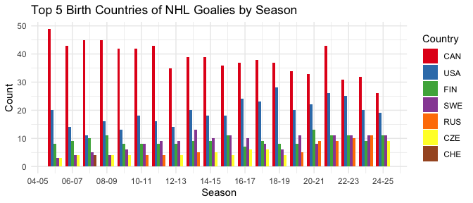
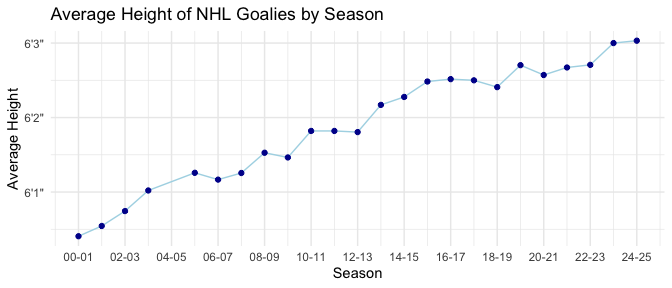
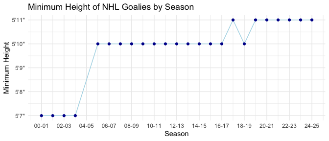
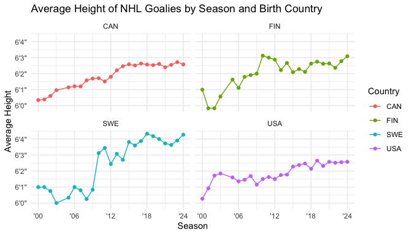
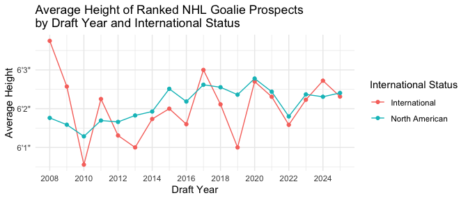
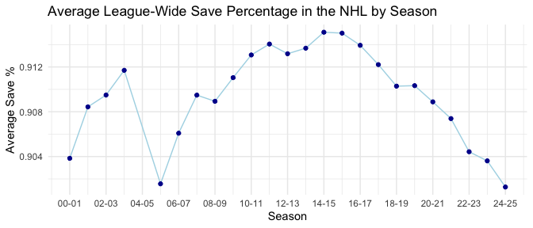
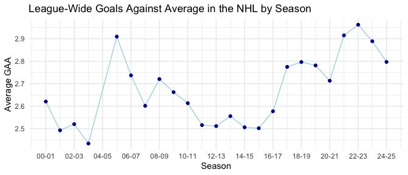
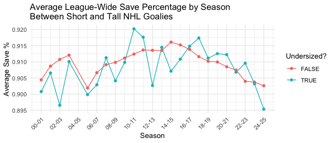
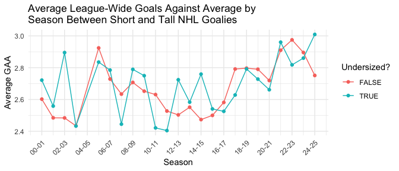

The Impact of Height on NHL Goalies (Preliminary Report)
================
Rayce Ramsay
2025-03-17

## Introduction

In the fast-paced and ever-changing landscape of the National Hockey
League (NHL), goaltenders play a critical role in determining the
outcome of games. Their ability to stop players from scoring using
speed, agility, and positioning makes them one of the most scrutinized
positions in professional hockey. Over the years, there has been ongoing
debate regarding the ideal physical attributes of a successful
goaltender, particularly when discussing height. While some argue that
taller goalies have an advantage due to their greater net coverage,
others suggest that shorter goalies may compensate with quicker reflexes
and mobility.

This study examines the relationship between a goaltender’s height and
their success in the NHL. Specifically, we analyze whether there has
been a historical trend in goalie height over the past 25 years and
whether this trend varies by country of origin. Additionally, we explore
whether taller goalies exhibit better statistical performance as
measured by save percentage (SV%) and goals against average (GAA)
compared to their shorter counterparts. Answering these questions should
provide insights into the evolving profile of NHL goaltenders and
contribute to the broader discussion on goalie development and scouting
strategies.

The data used in this study is sourced from publicly available NHL
statistics, including goalie biographies and performance metrics from
all seasons since 2000. This dataset has 2256 observations across 34
variables, featuring personal details such as the goaltender’s name,
height, birth country, and what season they played in. Performance
indicators like number of games played, number of shots faced, save
percentage, and goals against average are also included per season.
Additionally, we will assess a separate dataset that features the
heights of officially ranked NHL goalie prospects from each draft year
since 2008. This dataset includes 869 observations across 15 variables
with each prospect identified as either North American or international.
Through these datasets, we aim to provide a data-driven approach to
analyzing the impact of height on NHL goaltending performance.

## Methods

The data for this study was collected from a publicly available (but
undocumented) NHL API, using two primary base URLs:
<https://api.nhle.com/stats/rest/> and <https://api-web.nhle.com/>.
Since no official documentation exists, queries were structured based on
an unofficial API reference guide from GitHub
(<https://github.com/Zmalski/NHL-API-Reference>) and cross-referenced
with the official NHL website (<https://www.nhl.com/stats/goalies>) to
ensure accuracy. Two primary datasets were obtained: goalie season data,
covering every NHL season (i.e. regular season and playoffs combined)
since 2000, and prospect data, covering pre-NHL Entry Draft rankings for
every year since 2008. The goalie season data was retrieved through a
series of separate API requests for summary statistics and biographies,
which were then merged using unique player and season identifiers.
Similarly, prospect data was gathered through separate requests for
North American and international goalies and aggregated into a single
dataset. An additional column indicating prospect origin (i.e. North
American or not) was added during the merging process. All data was
exported to CSV files for further processing.

After importing the CSV files into a separate notebook, the datasets
were inspected and cleaned to ensure consistency and accuracy. Data
dimensions, headers, and footers were checked, column types were
corrected where necessary, and missing values in key variables were
assessed. In particular, discrete numeric variables had to be manually
converted to integer types and certain string columns such as birth
country were converted to factors for easier analysis. Special attention
was given to height values, which were validated using the NHL website
to confirm accuracy. Emergency backup goalies were identified and
removed, as their inclusion would not provide meaningful insights into
trends among regular NHL goaltenders. Additionally, missing save
percentage values were discovered but left as is since this indicates a
goalie who played but did not face any shots. The final rankings for
2025 prospects were also missing, but this was expected since they had
not yet been released when data extraction occurred.

Several new variables were created to facilitate analysis and provide
easier data validation. Age variables were derived from the birth date
of goalies/prospects for both datasets. Additionally, a binary
“undersized” variable was introduced to classify goalies at least two
inches shorter than the league average for their respective seasons. A
subset of “established” goalies was also created by filtering for
goalies who had appeared in at least 25 games in a given season (or 22
for the current 2024-2025 season). This threshold follows the NHL
website’s default threshold for displaying goalie statistics and is
useful for ensuring trends are true for goalies who get consistent
playing time rather than one-time call-ups.

Exploratory data analysis (EDA) was conducted using a range of
visualizations and statistical summaries. Line charts were created to
view trends in average goalie height over time, both league-wide and by
birth country. Similar visualizations were produced for prospects, with
goalies grouped by North American or international status. Histograms
and table summaries were used to examine the distributions of height,
SV%, and goals against average (GAA). Additionally, bar charts were
generated to show the number of NHL goalies by birth country for each
season. To assess the relationship between height and performance,
league-wide SV% and GAA were plotted over time, both overall and with
goalies grouped by undersized status. These tools provided a structured
approach to evaluating trends in NHL goaltender height and performance
over time.

## Preliminary Results

### Variable Overview

Over the past 25 years, NHL goalies have varied in height from 5’7” (67
inches) to 6’7” (79 inches) with an average height of about 6’2” (74
inches), as seen in Table 1. Similarly, Table 3 shows that these numbers
are comparable for NHL goalie prospects. This indicates a consistent
preference for taller goalies in the NHL. Save percentage and goals
against average show significant variation amongst all goalies, ranging
from 0.500 to 1.000 and 0.00 to 27.23, respectively. This is largely due
to inconsistencies in the number of games played for goalies. However,
when focusing only on established goaltenders — those with a minimum
threshold of games played per season — SV% and GAA fall within a tighter
range of .870 to 0.939 and 1.66 to 4.23, respectively, as shown in Table
2. This reflects greater stability in performance metrics for goalies
with more playing time.

<table class="table" style="width: auto !important; margin-left: auto; margin-right: auto;">
<caption>
Summary statistics for height, number of games played, save percentage,
and goals against average of NHL goalies in every season since 2000.
</caption>
<thead>
<tr>
<th style="text-align:left;">
Variable
</th>
<th style="text-align:right;">
Min.
</th>
<th style="text-align:right;">
1st Qu.
</th>
<th style="text-align:right;">
Mean
</th>
<th style="text-align:right;">
Median
</th>
<th style="text-align:right;">
3rd Qu.
</th>
<th style="text-align:right;">
Max.
</th>
</tr>
</thead>
<tbody>
<tr>
<td style="text-align:left;">
Height (in)
</td>
<td style="text-align:right;">
67.0
</td>
<td style="text-align:right;">
73.000
</td>
<td style="text-align:right;">
73.939
</td>
<td style="text-align:right;">
74.000
</td>
<td style="text-align:right;">
75.000
</td>
<td style="text-align:right;">
79.000
</td>
</tr>
<tr>
<td style="text-align:left;">
Games Played
</td>
<td style="text-align:right;">
1.0
</td>
<td style="text-align:right;">
7.000
</td>
<td style="text-align:right;">
29.325
</td>
<td style="text-align:right;">
25.000
</td>
<td style="text-align:right;">
47.000
</td>
<td style="text-align:right;">
97.000
</td>
</tr>
<tr>
<td style="text-align:left;">
SV%
</td>
<td style="text-align:right;">
0.5
</td>
<td style="text-align:right;">
0.893
</td>
<td style="text-align:right;">
0.901
</td>
<td style="text-align:right;">
0.907
</td>
<td style="text-align:right;">
0.917
</td>
<td style="text-align:right;">
1.000
</td>
</tr>
<tr>
<td style="text-align:left;">
GAA
</td>
<td style="text-align:right;">
0.0
</td>
<td style="text-align:right;">
2.424
</td>
<td style="text-align:right;">
2.889
</td>
<td style="text-align:right;">
2.767
</td>
<td style="text-align:right;">
3.177
</td>
<td style="text-align:right;">
27.273
</td>
</tr>
</tbody>
</table>
<table class="table" style="width: auto !important; margin-left: auto; margin-right: auto;">
<caption>
Summary statistics for height, number of games played, save percentage,
and goals against average of established NHL goalies in every season
since 2000.
</caption>
<thead>
<tr>
<th style="text-align:left;">
Variable
</th>
<th style="text-align:right;">
Min.
</th>
<th style="text-align:right;">
1st Qu.
</th>
<th style="text-align:right;">
Mean
</th>
<th style="text-align:right;">
Median
</th>
<th style="text-align:right;">
3rd Qu.
</th>
<th style="text-align:right;">
Max.
</th>
</tr>
</thead>
<tbody>
<tr>
<td style="text-align:left;">
Height (in)
</td>
<td style="text-align:right;">
67.000
</td>
<td style="text-align:right;">
73.000
</td>
<td style="text-align:right;">
73.976
</td>
<td style="text-align:right;">
74.000
</td>
<td style="text-align:right;">
75.000
</td>
<td style="text-align:right;">
79.000
</td>
</tr>
<tr>
<td style="text-align:left;">
Games Played
</td>
<td style="text-align:right;">
22.000
</td>
<td style="text-align:right;">
34.000
</td>
<td style="text-align:right;">
48.545
</td>
<td style="text-align:right;">
46.000
</td>
<td style="text-align:right;">
61.000
</td>
<td style="text-align:right;">
97.000
</td>
</tr>
<tr>
<td style="text-align:left;">
SV%
</td>
<td style="text-align:right;">
0.870
</td>
<td style="text-align:right;">
0.902
</td>
<td style="text-align:right;">
0.909
</td>
<td style="text-align:right;">
0.910
</td>
<td style="text-align:right;">
0.918
</td>
<td style="text-align:right;">
0.939
</td>
</tr>
<tr>
<td style="text-align:left;">
GAA
</td>
<td style="text-align:right;">
1.655
</td>
<td style="text-align:right;">
2.385
</td>
<td style="text-align:right;">
2.680
</td>
<td style="text-align:right;">
2.653
</td>
<td style="text-align:right;">
2.916
</td>
<td style="text-align:right;">
4.230
</td>
</tr>
</tbody>
</table>
<table class="table" style="width: auto !important; margin-left: auto; margin-right: auto;">
<caption>
Summary statistics for the height of ranked NHL goalie prospects in
every draft year since 2008.
</caption>
<thead>
<tr>
<th style="text-align:left;">
Variable
</th>
<th style="text-align:right;">
Min.
</th>
<th style="text-align:right;">
1st Qu.
</th>
<th style="text-align:right;">
Mean
</th>
<th style="text-align:right;">
Median
</th>
<th style="text-align:right;">
3rd Qu.
</th>
<th style="text-align:right;">
Max.
</th>
</tr>
</thead>
<tbody>
<tr>
<td style="text-align:left;">
Height (in)
</td>
<td style="text-align:right;">
67
</td>
<td style="text-align:right;">
73
</td>
<td style="text-align:right;">
74.1
</td>
<td style="text-align:right;">
74
</td>
<td style="text-align:right;">
75
</td>
<td style="text-align:right;">
80
</td>
</tr>
</tbody>
</table>

In terms of where NHL goalies have been born, Figure 1 shows how the
distribution of NHL goaltenders by birth country has changed over the
past 20 years. The figure illustrates how North America - particularly,
Canada - has been the biggest producer of NHL goaltenders during this
period. It appears, however, that the number of Canadian goalies in the
NHL has gradually decreased while the number of international goalies
has increased.

A bar chart displaying the top 5 most frequent birth countries of NHL
goalies by season.

### Trends in Height

Our analysis reveals a clear trend in NHL goaltender height over time.
As shown in Figure 2, the average height of NHL goalies has increased
steadily since 2000, rising from approximately 6’0.5” (72.5 inches) to
roughly 6’3” (75 inches) in recent seasons. The minimum height of NHL
goaltenders has also increased from 5’7” (67 inches) in 2000, to 5’10”
(70 inches) in 2005, and finally to 5’11” (71 inches) in 2019, as
demonstrated by Figure 3.

A line chart displaying the average height of NHL goalies by season.

A line chart displaying the minimum height of NHL goalies by season.

The upward trend in NHL goalie height appears consistent across most
birth countries, though Figure 4 highlights subtle differences across
the four biggest NHL goaltender-producing countries (i.e. Canada, the
United States, Finland, and Sweden). Compared to goaltenders from
Finland and Sweden, goalies from Canada and the United States show a
relatively more consistent increase in average height. While Canada and
Finland’s averages are currently around 6’3” (75 inches), the average is
slightly lower for the United States at 6’2.5” (74.5 inches) and
considerably higher for Sweden at around 6’4.5” (76.5 inches). Among
draft-eligible prospects, Figure 5 shows a less significant pattern.
Similar to NHL goalies, the average height of North American prospects
has stayed close to 6’2” (74 inches) with relatively similar growth
trends as the overall population. International goalies, on the other
hand, have varied between 6’1” (73 inches) and 6’3” (75 inches) over the
last 14 years. It is worth noting, however, that the number of ranked
international goalies per year has been consistently less than the North
American class, which could explain the extra variance.

A line chart displaying the average height of NHL goalies by season and
birth country for the top 4 goalie-producing countries.

A line chart displaying the average height of ranked NHL goalie
prospects by draft year and whether or not they were born in North
America.

### Trends in Performance

From a statistical perspective, NHL goaltending performance has
decreased over the past decade. Figure 6 demonstrates that the
league-wide average save percentage has trended downwards since the
2014-15 season, starting at 0.915 and finishing at 0.901. As expected,
the league-wide goals against average increased over the same period
from 2.50 in 2014-15 to 2.80 in 2024-25, while peaking at 2.96 in
2022-23. This decrease is shown in Figure 7. Comparable numbers and
trends are prevalent when strictly analyzing established goalies. This
makes sense given that approximately 85% of the shots against and 84% of
the goals against in the past 25 years have happened on established
goalies.

A line chart displaying the average save percentage across all NHL
goalies in each season.

A line chart displaying the goals against average across all NHL goalies
in each season.

### Trends in Height and Performance

There appears to be little difference in performance between shorter and
taller goalies. Figures 8 and 9 illustrate this by comparing the average
save percentage and goals against average for both groups over the past
25 years. As shown in Figure 8, save percentages have remained
relatively similar across most seasons, regardless of height. Likewise,
Figure 9 reveals a comparable trend in goals against average, suggesting
that height does not play a significant role in these performance
metrics.

A line chart displaying the average save percentage across all NHL
goalies in each season grouped by whether the goalies are tall or short.

A line chart displaying the goals against average across all NHL goalies
in each season grouped by whether the goalies are tall or short

## Summary

This analysis confirms that NHL goaltenders have become increasingly
taller over the past 25 years, reinforcing the league’s apparent
preference for taller goalies. This trend is consistent across most
major goaltender-producing countries, with Sweden currently leading the
way in average goaltender height. While a somewhat similar trend exists
for drafted goalie prospects, the variation is more pronounced,
particularly among international prospects.

Alongside the shift in height, the distribution of goaltenders by birth
country has also shifted. While Canada once had an overwhelmingly large
presence in the NHL goalie scene, there has been a decline in Canadian
representation and a growing presence of international goalies. This
suggests that goaltender development has become more globalized, with
more nations producing NHL-caliber talent.

Despite the shift toward taller goaltenders, simple performance metrics
do not show this as a clear advantage. The comparison of save percentage
and goals against average between shorter and taller goalies reveals
minimal differences. This suggests that factors beyond height play a
more significant role in goaltender success. Additionally, league-wide
goaltending performance has declined statistically over the past decade,
with a downward trend in save percentage and an increase in goals
against average. This is likely influenced by broader changes in
offensive strategies and league-wide rule adjustments as opposed to the
physical height of goalies.

Although the findings of this study suggest that height may not be a
determining factor in elite goaltending performance, a more
comprehensive analysis is needed to validate this conclusion. To further
investigate, we will develop predictive models that account for
additional variables beyond height, such as team strength, to assess
their impact on key performance metrics like save percentage and goals
against average. These models will incorporate techniques such as linear
regression, decision trees, and XGBoost to identify potential patterns
and relationships. We will also explore modelling more advanced
performance metrics, including expected goals against, high-danger save
percentage, and year-to-year performance stability if necessary. While
this may require further data extraction and cleaning, incorporating
these refined metrics could provide deeper insights into how height
influences goaltender success.
