The Impact of Height on NHL Goalies (Modelling)
================
Rayce Ramsay
2025-04-28

## Setup

``` r
# Load libraries
library(kableExtra)
library(tidyverse)
```

    ## ── Attaching core tidyverse packages ──────────────────────── tidyverse 2.0.0 ──
    ## ✔ dplyr     1.1.4     ✔ readr     2.1.5
    ## ✔ forcats   1.0.0     ✔ stringr   1.5.1
    ## ✔ ggplot2   3.5.1     ✔ tibble    3.2.1
    ## ✔ lubridate 1.9.4     ✔ tidyr     1.3.1
    ## ✔ purrr     1.0.4     
    ## ── Conflicts ────────────────────────────────────────── tidyverse_conflicts() ──
    ## ✖ dplyr::filter()     masks stats::filter()
    ## ✖ dplyr::group_rows() masks kableExtra::group_rows()
    ## ✖ dplyr::lag()        masks stats::lag()
    ## ℹ Use the conflicted package (<http://conflicted.r-lib.org/>) to force all conflicts to become errors

``` r
library(mgcv)
```

    ## Loading required package: nlme
    ## 
    ## Attaching package: 'nlme'
    ## 
    ## The following object is masked from 'package:dplyr':
    ## 
    ##     collapse
    ## 
    ## This is mgcv 1.9-1. For overview type 'help("mgcv-package")'.

``` r
library(GGally)
```

    ## Registered S3 method overwritten by 'GGally':
    ##   method from   
    ##   +.gg   ggplot2

``` r
library(rpart)
library(rpart.plot)
library(randomForest)
```

    ## randomForest 4.7-1.2
    ## Type rfNews() to see new features/changes/bug fixes.
    ## 
    ## Attaching package: 'randomForest'
    ## 
    ## The following object is masked from 'package:dplyr':
    ## 
    ##     combine
    ## 
    ## The following object is masked from 'package:ggplot2':
    ## 
    ##     margin

``` r
library(pdp)
```

    ## 
    ## Attaching package: 'pdp'
    ## 
    ## The following object is masked from 'package:purrr':
    ## 
    ##     partial

## Previous Data Loading and Pre-Processing

``` r
# Load data extracted from the NHL APIs (extraction done in separate file)
goalies = read_csv("../data/nhl_goalies_data.csv")
```

    ## Rows: 2256 Columns: 34
    ## ── Column specification ────────────────────────────────────────────────────────
    ## Delimiter: ","
    ## chr   (9): birthCity, birthCountryCode, birthStateProvinceCode, fullName, is...
    ## dbl  (24): draftOverall, draftRound, draftYear, height, playerId, weight, se...
    ## date  (1): birthDate
    ## 
    ## ℹ Use `spec()` to retrieve the full column specification for this data.
    ## ℹ Specify the column types or set `show_col_types = FALSE` to quiet this message.

``` r
prospects = read_csv("../data/nhl_goalie_prospects_data.csv")
```

    ## Rows: 869 Columns: 15
    ## ── Column specification ────────────────────────────────────────────────────────
    ## Delimiter: ","
    ## chr  (8): positionCode, catches, lastAmateurClub, lastAmateurLeague, birthCi...
    ## dbl  (5): height, weight, midtermRank, finalRank, draftYear
    ## lgl  (1): international
    ## date (1): birthDate
    ## 
    ## ℹ Use `spec()` to retrieve the full column specification for this data.
    ## ℹ Specify the column types or set `show_col_types = FALSE` to quiet this message.

``` r
# Convert the invalid double columns in the goalies data to integers and create some factors
goalies = goalies |>
  mutate(
    across(
      c(seasonId, playerId, height, weight, draftYear, draftRound, draftOverall, assists, 
        gamesPlayed, gamesStarted, goals, goalsAgainst, losses, otLosses, penaltyMinutes,
        points, saves, shotsAgainst, shutouts, ties, timeOnIce, wins),
      as.integer
    ),
    across(
      c(birthCountryCode, isInHallOfFameYn, catches),
      as.factor
    )
  )

# Convert the invalid double columns in the prospects data to integers and create some factors
prospects = prospects |>
  mutate(
    across(
      c(draftYear, height, weight, midtermRank, finalRank),
      as.integer
    ),
    across(
      c(positionCode, catches, birthCountryCode),
      as.factor
    )
  )

# Create column for checking whether a goalie was drafted or not
goalies = goalies |>
  mutate(
    drafted = !is.na(draftYear)
  )

# Create column for goalie age as of the beginning of the season (i.e. September 15th as per NHL Hockey Operations Guidelines)
goalies = goalies |>
  separate(seasonId, into = c("seasonStartYear", "seasonEndYear"), sep = 4,
           convert = T, remove = F) |>
  mutate(
    ageAtSeasonStart = as.integer(
      interval(birthDate, date(paste0(seasonStartYear, "-09-15"))) / years()
    )
  )

# Get the average goalie height minus 2 inches for every season
undersize_heights_per_season = goalies |>
  group_by(seasonId) |>
  summarize(
    undersize_threshold = mean(height) - 2
  ) |>
  ungroup()

# Create column classifying a goalie as undersized or not (i.e. <= 2" below average)
goalies = goalies |>
  left_join(undersize_heights_per_season, by = "seasonId") |>
  mutate(
    undersized = height <= undersize_threshold
  )

# Create column for prospect age as of the start of the next season (i.e. September 15th as per NHL Hockey Operations Guidelines)
prospects = prospects |>
  mutate(
    draftYearAge = as.integer(
      interval(birthDate, date(paste0(draftYear, "-09-15"))) / years()
    )
  )

# Find emergency situation goalies
emergency_goalies = goalies |>
  filter (fullName %in% c("Shawn Hunwick", "Jorge Alves", "Jett Alexander",
                          "Thomas Hodges", "Matthew Berlin", "Scott Foster"))

# Remove emergency goalies from data
goalies = goalies |>
  anti_join(emergency_goalies, by = "playerId")

# Get established goalies
established_goalies = goalies |>
  filter(gamesPlayed >= 25 | (gamesPlayed >= 22 & seasonStartYear == 2024))
```

## More Data Loading and Validation

``` r
# Load NHL team standings data (extracted in separate file)
teams = read_csv("../data/nhl_teams_data.csv")
```

    ## Rows: 490 Columns: 6
    ## ── Column specification ────────────────────────────────────────────────────────
    ## Delimiter: ","
    ## chr (1): teamAbbrev
    ## dbl (5): seasonId, iceTime, xGoalsAgainst, blockedShotAttemptsAgainst, dZone...
    ## 
    ## ℹ Use `spec()` to retrieve the full column specification for this data.
    ## ℹ Specify the column types or set `show_col_types = FALSE` to quiet this message.

``` r
# Check for import issues with NHL teams data
dim(teams)
```

    ## [1] 490   6

``` r
head(teams)
```

    ## # A tibble: 6 × 6
    ##   seasonId teamAbbrev iceTime xGoalsAgainst blockedShotAttemptsAgainst
    ##      <dbl> <chr>        <dbl>         <dbl>                      <dbl>
    ## 1 20082009 MIN         299195          202.                       1033
    ## 2 20082009 BOS         295613          216.                       1050
    ## 3 20082009 ARI         294089          224.                       1187
    ## 4 20082009 LAK         300139          221.                       1040
    ## 5 20082009 COL         299370          215.                       1317
    ## 6 20082009 DAL         300273          223.                        982
    ## # ℹ 1 more variable: dZoneGiveawaysAgainst <dbl>

``` r
tail(teams)
```

    ## # A tibble: 6 × 6
    ##   seasonId teamAbbrev iceTime xGoalsAgainst blockedShotAttemptsAgainst
    ##      <dbl> <chr>        <dbl>         <dbl>                      <dbl>
    ## 1 20242025 NYI         298682          259.                       1459
    ## 2 20242025 SEA         297525          267.                       1441
    ## 3 20242025 OTT         297335          256.                       1391
    ## 4 20242025 LAK         297801          214.                       1302
    ## 5 20242025 DAL         297658          253.                       1262
    ## 6 20242025 CHI         297870          279.                       1354
    ## # ℹ 1 more variable: dZoneGiveawaysAgainst <dbl>

``` r
# Convert the invalid double columns in the teams data to integers and create some factors
teams = teams |>
  mutate(
    across(
      c(seasonId, blockedShotAttemptsAgainst, dZoneGiveawaysAgainst),
      as.integer
    ),
    across(
      c(teamAbbrev),
      as.factor
    )
  )
```

``` r
# Check the variable types in the teams data
str(teams)
```

    ## tibble [490 × 6] (S3: tbl_df/tbl/data.frame)
    ##  $ seasonId                  : int [1:490] 20082009 20082009 20082009 20082009 20082009 20082009 20082009 20082009 20082009 20082009 ...
    ##  $ teamAbbrev                : Factor w/ 34 levels "ANA","ARI","ATL",..: 16 4 2 15 10 11 29 6 22 5 ...
    ##  $ iceTime                   : num [1:490] 299195 295613 294089 300139 299370 ...
    ##  $ xGoalsAgainst             : num [1:490] 202 216 224 221 215 ...
    ##  $ blockedShotAttemptsAgainst: int [1:490] 1033 1050 1187 1040 1317 982 1239 1194 1166 1083 ...
    ##  $ dZoneGiveawaysAgainst     : int [1:490] 257 293 228 471 291 467 531 300 529 400 ...

``` r
# Summarize the teams data
summary(teams)
```

    ##     seasonId          teamAbbrev     iceTime       xGoalsAgainst  
    ##  Min.   :20082009   ANA    : 16   Min.   :173904   Min.   :102.2  
    ##  1st Qu.:20122013   BOS    : 16   1st Qu.:297536   1st Qu.:203.0  
    ##  Median :20162017   BUF    : 16   Median :298796   Median :224.6  
    ##  Mean   :20159364   CAR    : 16   Mean   :282769   Mean   :218.5  
    ##  3rd Qu.:20202021   CBJ    : 16   3rd Qu.:299748   3rd Qu.:242.4  
    ##  Max.   :20242025   CGY    : 16   Max.   :308162   Max.   :313.4  
    ##                     (Other):394                                   
    ##  blockedShotAttemptsAgainst dZoneGiveawaysAgainst
    ##  Min.   : 511               Min.   :141.0        
    ##  1st Qu.:1006               1st Qu.:303.2        
    ##  Median :1130               Median :377.0        
    ##  Mean   :1114               Mean   :392.0        
    ##  3rd Qu.:1259               3rd Qu.:472.5        
    ##  Max.   :1673               Max.   :789.0        
    ## 

We have 490 rows across 6 variables for the NHL teams data. No
unexpected import issues found. It appears all variables in the teams
data have reasonable values.

## More Data Processing

``` r
# Limit each goalies team to be the team they finished the season with
goalies = goalies |>
  mutate(
    teamAbbrev = as.factor(substr(teamAbbrevs, nchar(teamAbbrevs) - 2, nchar(teamAbbrevs))) # take last 3 chars
  )

table(goalies$teamAbbrev)
```

    ## 
    ## ANA ARI ATL BOS BUF CAR CBJ CGY CHI COL DAL DET EDM FLA LAK MIN MTL NJD NSH NYI 
    ##  71  39  34  73  77  75  74  65  78  77  68  72  66  64  76  71  70  73  66  75 
    ## NYR OTT PHI PHX PIT SEA SJS STL TBL TOR UTA VAN VGK WPG WSH 
    ##  75  87  82  40  73  13  67  76  80  77   3  76  31  36  70

``` r
# Normalize team stats to be per 60 minutes played for comparison
teams = teams |>
  mutate(
    teamXGoalsAgainstPer60 = (xGoalsAgainst / iceTime) * 3600,
    teamBlockedShotsPer60 = (blockedShotAttemptsAgainst / iceTime) * 3600,
    teamDZoneGiveawaysPer60 = (dZoneGiveawaysAgainst / iceTime) * 3600
  ) |>
  rename(teamIceTime = iceTime) |>
  select(!c(xGoalsAgainst, blockedShotAttemptsAgainst, dZoneGiveawaysAgainst))

summary(teams)
```

    ##     seasonId          teamAbbrev   teamIceTime     teamXGoalsAgainstPer60
    ##  Min.   :20082009   ANA    : 16   Min.   :173904   Min.   :2.101         
    ##  1st Qu.:20122013   BOS    : 16   1st Qu.:297536   1st Qu.:2.585         
    ##  Median :20162017   BUF    : 16   Median :298796   Median :2.776         
    ##  Mean   :20159364   CAR    : 16   Mean   :282769   Mean   :2.775         
    ##  3rd Qu.:20202021   CBJ    : 16   3rd Qu.:299748   3rd Qu.:2.946         
    ##  Max.   :20242025   CGY    : 16   Max.   :308162   Max.   :3.783         
    ##                     (Other):394                                          
    ##  teamBlockedShotsPer60 teamDZoneGiveawaysPer60
    ##  Min.   : 8.876        Min.   :2.593          
    ##  1st Qu.:12.831        1st Qu.:3.882          
    ##  Median :14.124        Median :4.788          
    ##  Mean   :14.148        Mean   :4.986          
    ##  3rd Qu.:15.340        3rd Qu.:5.866          
    ##  Max.   :20.144        Max.   :9.803          
    ## 

``` r
# Denormalize the goalies data to include team stats of the last team they played on in each season (starting in 2008)
goalies = goalies |>
  inner_join(teams, by = c("seasonId", "teamAbbrev")) |>
  relocate(seasonId, playerId, teamAbbrev)

dim(goalies)
```

    ## [1] 1489   45

``` r
head(goalies)
```

    ## # A tibble: 6 × 45
    ##   seasonId playerId teamAbbrev birthCity  birthCountryCode birthDate 
    ##      <int>    <int> <fct>      <chr>      <fct>            <date>    
    ## 1 20082009  8467913 OTT        Cold Lake  CAN              1981-01-07
    ## 2 20082009  8467453 COL        Belleville CAN              1980-05-04
    ## 3 20082009  8467511 PHI        Turku      FIN              1980-06-18
    ## 4 20082009  8474550 CHI        Vantaa     FIN              1983-08-29
    ## 5 20082009  8471750 STL        Denver     USA              1986-11-21
    ## 6 20082009  8462161 WSH        Farmington USA              1977-03-12
    ## # ℹ 39 more variables: birthStateProvinceCode <chr>, draftOverall <int>,
    ## #   draftRound <int>, draftYear <int>, fullName <chr>, height <int>,
    ## #   isInHallOfFameYn <fct>, lastName <chr>, nationalityCode <chr>,
    ## #   catches <fct>, weight <int>, seasonStartYear <int>, seasonEndYear <int>,
    ## #   assists <int>, gamesPlayed <int>, gamesStarted <int>, goals <int>,
    ## #   goalsAgainst <int>, goalsAgainstAverage <dbl>, losses <int>,
    ## #   otLosses <int>, penaltyMinutes <int>, points <int>, savePct <dbl>, …

``` r
tail(goalies)
```

    ## # A tibble: 6 × 45
    ##   seasonId playerId teamAbbrev birthCity           birthCountryCode birthDate 
    ##      <int>    <int> <fct>      <chr>               <fct>            <date>    
    ## 1 20242025  8477465 PIT        Surrey              CAN              1995-04-29
    ## 2 20242025  8480045 BUF        Espoo               FIN              1999-03-09
    ## 3 20242025  8478024 ANA        Helsinki            FIN              1995-02-06
    ## 4 20242025  8477970 FLA        Havlickuv Brod      CZE              1996-01-09
    ## 5 20242025  8484293 CAR        Dollard-des-Ormeaux CAN              2000-03-04
    ## 6 20242025  8482137 SJS        Omsk                RUS              2002-06-16
    ## # ℹ 39 more variables: birthStateProvinceCode <chr>, draftOverall <int>,
    ## #   draftRound <int>, draftYear <int>, fullName <chr>, height <int>,
    ## #   isInHallOfFameYn <fct>, lastName <chr>, nationalityCode <chr>,
    ## #   catches <fct>, weight <int>, seasonStartYear <int>, seasonEndYear <int>,
    ## #   assists <int>, gamesPlayed <int>, gamesStarted <int>, goals <int>,
    ## #   goalsAgainst <int>, goalsAgainstAverage <dbl>, losses <int>,
    ## #   otLosses <int>, penaltyMinutes <int>, points <int>, savePct <dbl>, …

``` r
# Get established goalies again (since goalies has changed)
established_goalies = goalies |>
  filter(gamesPlayed >= 25 | (gamesPlayed >= 22 & seasonStartYear == 2024))

dim(established_goalies)
```

    ## [1] 765  45

## More EDA

``` r
# Explore distribution of team expected goals against per 60 minutes
teams |>
  ggplot(aes(teamXGoalsAgainstPer60)) +
  geom_histogram(binwidth = 0.05, color = "black", fill = "lightblue") +
  labs(
    title = "Distribution of Team Expected Goals Against Per 60 Minutes\nfor Every Season Since 2008",
    x = "Expected Goals Against Per 60 Minutes",
    y = "Frequency"
  )
```

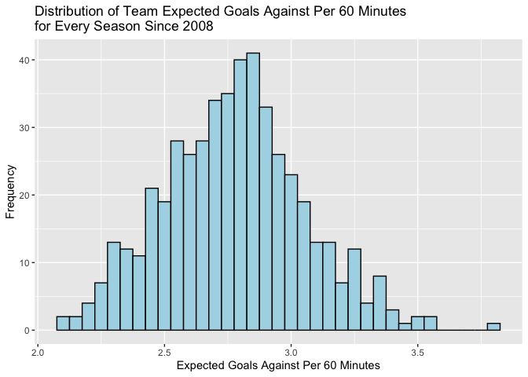<!-- -->

``` r
# Explore distribution of team blocked shots per 60 minutes
teams |>
  ggplot(aes(teamBlockedShotsPer60)) +
  geom_histogram(binwidth = 0.3, color = "black", fill = "lightblue") +
  labs(
    title = "Distribution of Team Blocked Shots Per 60 Minutes\nfor Every Season Since 2008",
    x = "Blocked Shots Per 60 Minutes",
    y = "Frequency"
  )
```

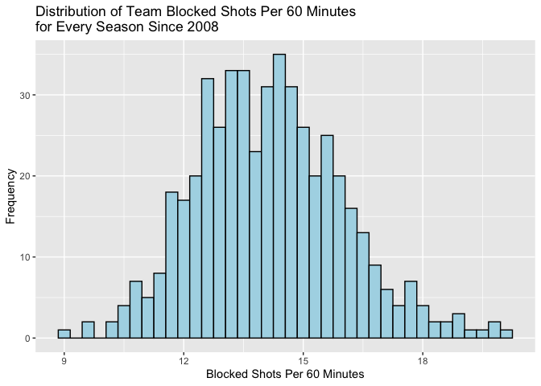<!-- -->

``` r
# Explore distribution of team dzone giveaways per 60 minutes
teams |>
  ggplot(aes(teamDZoneGiveawaysPer60)) +
  geom_histogram(binwidth = 0.2, color = "black", fill = "lightblue") +
  labs(
    title = "Distribution of Team DZone Giveaways Per 60 Minutes\nfor Every Season Since 2008",
    x = "DZone Giveaways Per 60 Minutes",
    y = "Frequency"
  )
```

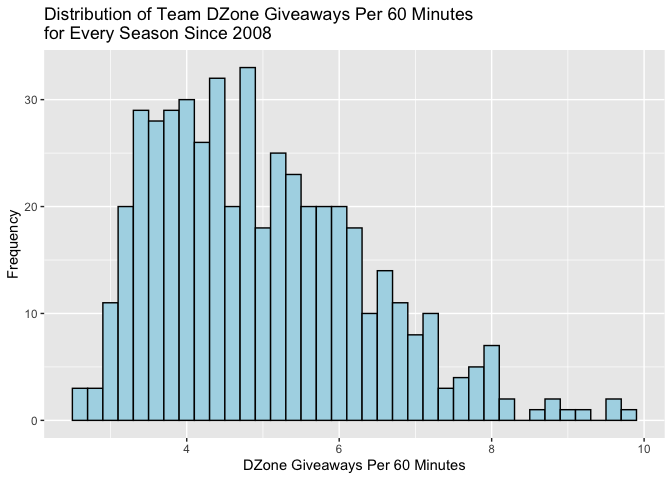<!-- -->

Expected goals against per 60 minutes and blocked shots per 60 minutes
appear to be normally distributed. Meanwhile, defensive zone giveaways
per 60 minutes appears to be right skewed.

``` r
# Visualize relationships between performance metrics and goalie characteristics
established_goalies |>
  select(height, weight, ageAtSeasonStart, savePct, goalsAgainstAverage) |>
  rename(Height = height, Weight = weight, Age = ageAtSeasonStart, `SV%` = savePct, GAA = goalsAgainstAverage) |>
  ggpairs()
```

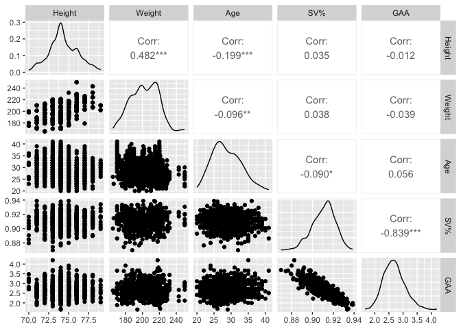<!-- -->

``` r
# Visualize relationships between performance metrics and team stats
established_goalies |>
  select(teamXGoalsAgainstPer60, teamBlockedShotsPer60, teamDZoneGiveawaysPer60, savePct, goalsAgainstAverage) |>
  rename(xGAA = teamXGoalsAgainstPer60, `Avg Blocks` = teamBlockedShotsPer60, `Avg DZone Giveaways` = teamDZoneGiveawaysPer60, `SV%` = savePct, GAA = goalsAgainstAverage) |>
  ggpairs()
```

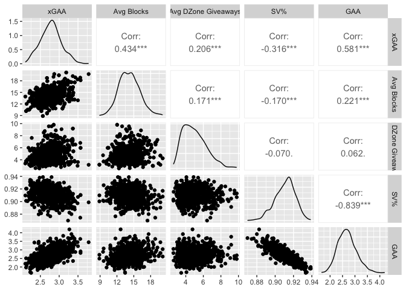<!-- -->

``` r
# Visualize relationships between performance metrics and time
established_goalies |>
  select(seasonStartYear, savePct, goalsAgainstAverage) |>
  rename(Season = seasonStartYear, `SV%` = savePct, GAA = goalsAgainstAverage) |>
  ggpairs()
```

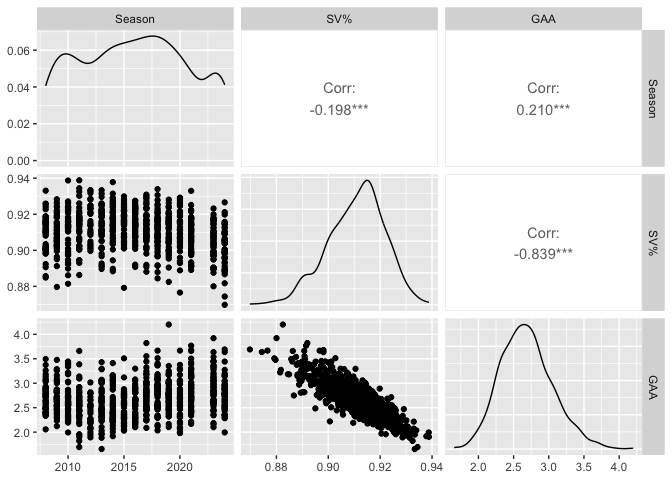<!-- -->

SV% and GAA appear to be moderately correlated with team expected goals
against average, weakly to moderately correlated with average team
blocks per 60 minutes, and very weakly correlated with average team
dzone giveaways per 60 minutes. Additionally, SV% appears to have a left
skew while GAA has a slight right skew. The beta distribution makes
sense for SV% since it is continuous and bounded between 0 and 1. The
gamma distribution makes sense for GAA since it is positive and skewed
to the right.

## GAM Modelling

``` r
# Fit a GAM for SV% using height
savePct_gam = gam(
  savePct ~ 
    s(seasonStartYear, bs="cr", k=10) 
  + s(height, bs="cr", k=10) 
  + s(weight, bs="cr", k=20) 
  + s(ageAtSeasonStart, bs="cr", k=20)
  + s(teamXGoalsAgainstPer60, bs="cr", k=20) 
  + s(teamBlockedShotsPer60, bs="cr", k=20) 
  + s(teamDZoneGiveawaysPer60, bs="cr", k=20) 
  + s(birthCountryCode, bs="re") 
  + s(teamAbbrev, bs="re") 
  + catches, 
  data = established_goalies,
  method = "ML",
  family = betar(link = "logit")
)

summary(savePct_gam)
```

    ## 
    ## Family: Beta regression(891.2) 
    ## Link function: logit 
    ## 
    ## Formula:
    ## savePct ~ s(seasonStartYear, bs = "cr", k = 10) + s(height, bs = "cr", 
    ##     k = 10) + s(weight, bs = "cr", k = 20) + s(ageAtSeasonStart, 
    ##     bs = "cr", k = 20) + s(teamXGoalsAgainstPer60, bs = "cr", 
    ##     k = 20) + s(teamBlockedShotsPer60, bs = "cr", k = 20) + s(teamDZoneGiveawaysPer60, 
    ##     bs = "cr", k = 20) + s(birthCountryCode, bs = "re") + s(teamAbbrev, 
    ##     bs = "re") + catches
    ## 
    ## Parametric coefficients:
    ##              Estimate Std. Error z value Pr(>|z|)    
    ## (Intercept)  2.324510   0.009584  242.54   <2e-16 ***
    ## catchesR    -0.004211   0.018319   -0.23    0.818    
    ## ---
    ## Signif. codes:  0 '***' 0.001 '**' 0.01 '*' 0.05 '.' 0.1 ' ' 1
    ## 
    ## Approximate significance of smooth terms:
    ##                               edf Ref.df Chi.sq  p-value    
    ## s(seasonStartYear)          3.210  3.956 43.443  < 2e-16 ***
    ## s(height)                   1.000  1.000  1.272 0.259367    
    ## s(weight)                   2.189  2.774  3.870 0.265172    
    ## s(ageAtSeasonStart)         1.236  1.433  4.037 0.053017 .  
    ## s(teamXGoalsAgainstPer60)   1.001  1.003 29.674  < 2e-16 ***
    ## s(teamBlockedShotsPer60)    1.001  1.001  0.596 0.440587    
    ## s(teamDZoneGiveawaysPer60)  1.001  1.002  0.035 0.853424    
    ## s(birthCountryCode)         4.824 13.000 23.023 0.000249 ***
    ## s(teamAbbrev)              16.450 33.000 38.666 0.000132 ***
    ## ---
    ## Signif. codes:  0 '***' 0.001 '**' 0.01 '*' 0.05 '.' 0.1 ' ' 1
    ## 
    ## R-sq.(adj) =  0.215   Deviance explained =   25%
    ## -ML = -2455.2  Scale est. = 1         n = 765

``` r
plot(savePct_gam)
```

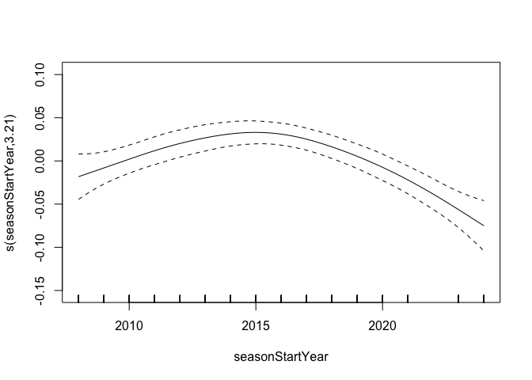<!-- -->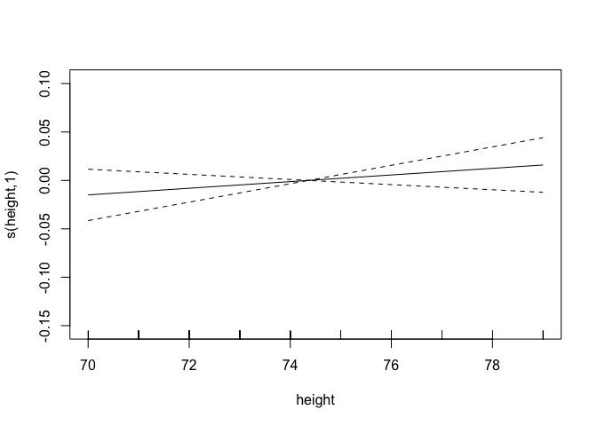<!-- -->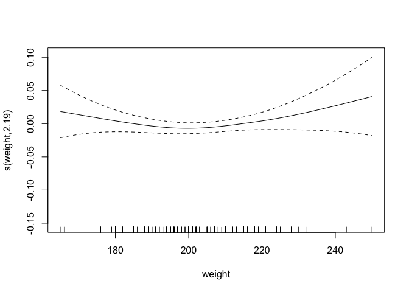<!-- -->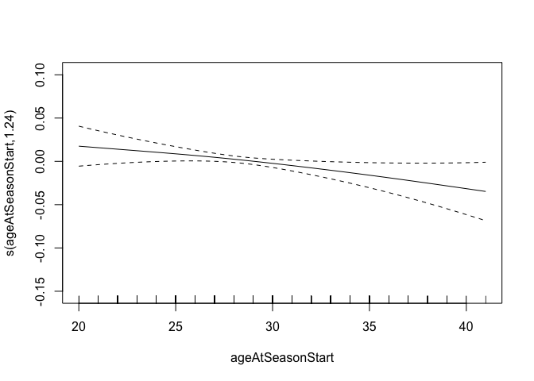<!-- --><!-- --><!-- -->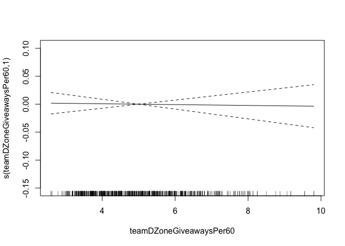<!-- -->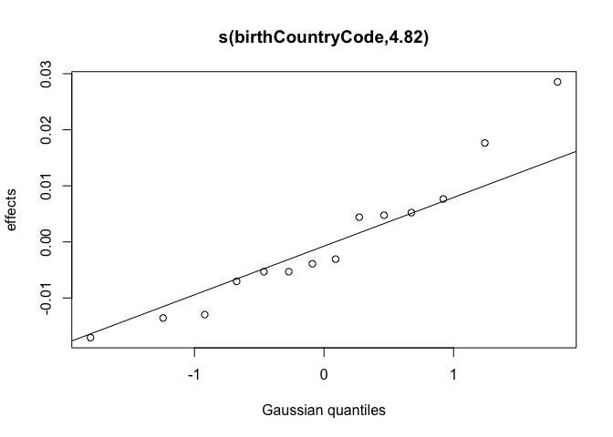<!-- --><!-- -->

``` r
# Check diagnostics for SV% GAM with height
gam.check(savePct_gam)
```

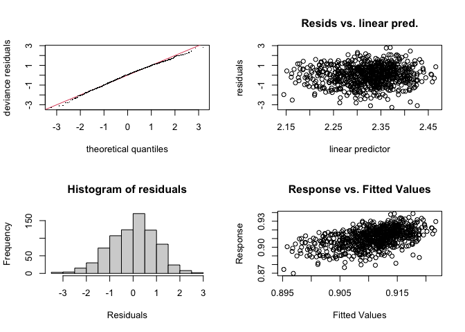<!-- -->

    ## 
    ## Method: ML   Optimizer: outer newton
    ## full convergence after 12 iterations.
    ## Gradient range [-0.0004850616,0.0005750555]
    ## (score -2455.25 & scale 1).
    ## Hessian positive definite, eigenvalue range [1.378693e-05,364.0157].
    ## Model rank =  163 / 163 
    ## 
    ## Basis dimension (k) checking results. Low p-value (k-index<1) may
    ## indicate that k is too low, especially if edf is close to k'.
    ## 
    ##                               k'   edf k-index p-value  
    ## s(seasonStartYear)          9.00  3.21    1.02    0.73  
    ## s(height)                   9.00  1.00    1.02    0.69  
    ## s(weight)                  19.00  2.19    0.96    0.14  
    ## s(ageAtSeasonStart)        19.00  1.24    1.02    0.77  
    ## s(teamXGoalsAgainstPer60)  19.00  1.00    0.97    0.18  
    ## s(teamBlockedShotsPer60)   19.00  1.00    0.94    0.04 *
    ## s(teamDZoneGiveawaysPer60) 19.00  1.00    0.99    0.42  
    ## s(birthCountryCode)        14.00  4.82      NA      NA  
    ## s(teamAbbrev)              34.00 16.45      NA      NA  
    ## ---
    ## Signif. codes:  0 '***' 0.001 '**' 0.01 '*' 0.05 '.' 0.1 ' ' 1

``` r
# Fit a GAM for GAA using height
gaa_gam = gam(
  goalsAgainstAverage ~ 
    s(seasonStartYear, bs="cr", k=10) 
  + s(height, bs="cr", k=10) 
  + s(weight, bs="cr", k=20) 
  + s(ageAtSeasonStart, bs="cr", k=20)
  + s(teamXGoalsAgainstPer60, bs="cr", k=20) 
  + s(teamBlockedShotsPer60, bs="cr", k=20) 
  + s(teamDZoneGiveawaysPer60, bs="cr", k=20) 
  + s(birthCountryCode, bs="re") 
  + s(teamAbbrev, bs="re") 
  + catches,
  data = established_goalies,
  method = "ML",
  family = Gamma(link = "log")
)

summary(gaa_gam)
```

    ## 
    ## Family: Gamma 
    ## Link function: log 
    ## 
    ## Formula:
    ## goalsAgainstAverage ~ s(seasonStartYear, bs = "cr", k = 10) + 
    ##     s(height, bs = "cr", k = 10) + s(weight, bs = "cr", k = 20) + 
    ##     s(ageAtSeasonStart, bs = "cr", k = 20) + s(teamXGoalsAgainstPer60, 
    ##     bs = "cr", k = 20) + s(teamBlockedShotsPer60, bs = "cr", 
    ##     k = 20) + s(teamDZoneGiveawaysPer60, bs = "cr", k = 20) + 
    ##     s(birthCountryCode, bs = "re") + s(teamAbbrev, bs = "re") + 
    ##     catches
    ## 
    ## Parametric coefficients:
    ##             Estimate Std. Error t value Pr(>|t|)    
    ## (Intercept) 0.980219   0.008407 116.596   <2e-16 ***
    ## catchesR    0.014966   0.016566   0.903    0.367    
    ## ---
    ## Signif. codes:  0 '***' 0.001 '**' 0.01 '*' 0.05 '.' 0.1 ' ' 1
    ## 
    ## Approximate significance of smooth terms:
    ##                               edf Ref.df       F  p-value    
    ## s(seasonStartYear)          4.819  5.833   4.336 0.000280 ***
    ## s(height)                   1.000  1.000   0.716 0.397835    
    ## s(weight)                   1.000  1.000   0.012 0.911550    
    ## s(ageAtSeasonStart)         1.850  2.342   1.631 0.209694    
    ## s(teamXGoalsAgainstPer60)   1.000  1.000 248.322  < 2e-16 ***
    ## s(teamBlockedShotsPer60)    1.001  1.001   0.343 0.558922    
    ## s(teamDZoneGiveawaysPer60)  1.000  1.000   1.233 0.267223    
    ## s(birthCountryCode)         4.376 13.000   1.375 0.001846 ** 
    ## s(teamAbbrev)              17.298 33.000   1.271 0.000113 ***
    ## ---
    ## Signif. codes:  0 '***' 0.001 '**' 0.01 '*' 0.05 '.' 0.1 ' ' 1
    ## 
    ## R-sq.(adj) =  0.414   Deviance explained = 44.1%
    ## -ML = 128.83  Scale est. = 0.011177  n = 765

``` r
plot(gaa_gam)
```

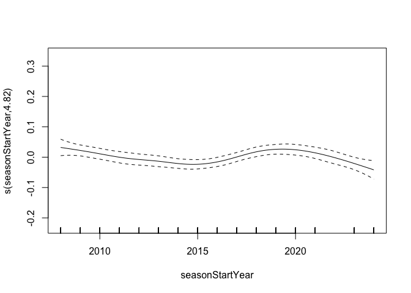<!-- -->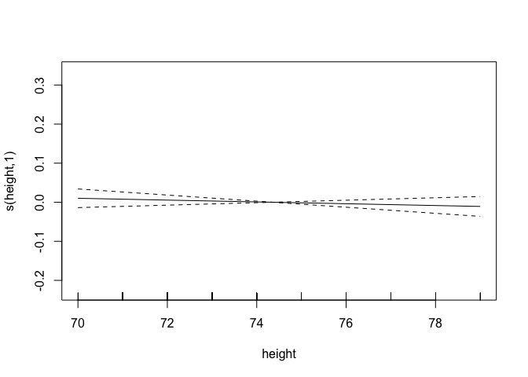<!-- -->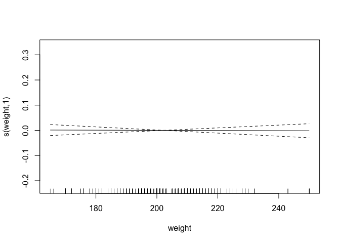<!-- --><!-- --><!-- --><!-- --><!-- -->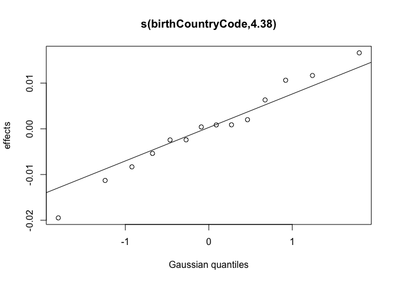<!-- -->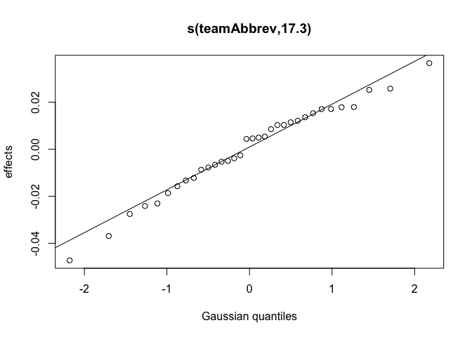<!-- -->

``` r
# Check diagnostics for GAA GAM using height
gam.check(gaa_gam)
```

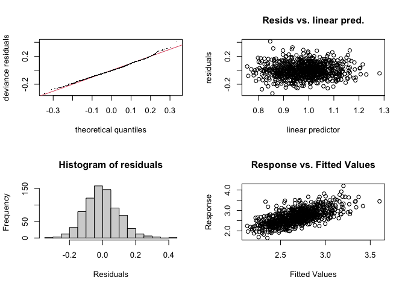<!-- -->

    ## 
    ## Method: ML   Optimizer: outer newton
    ## full convergence after 14 iterations.
    ## Gradient range [-3.394565e-05,0.0003006665]
    ## (score 128.8342 & scale 0.01117685).
    ## Hessian positive definite, eigenvalue range [5.622321e-06,384.1277].
    ## Model rank =  163 / 163 
    ## 
    ## Basis dimension (k) checking results. Low p-value (k-index<1) may
    ## indicate that k is too low, especially if edf is close to k'.
    ## 
    ##                               k'   edf k-index p-value
    ## s(seasonStartYear)          9.00  4.82    1.04    0.89
    ## s(height)                   9.00  1.00    1.02    0.69
    ## s(weight)                  19.00  1.00    0.99    0.42
    ## s(ageAtSeasonStart)        19.00  1.85    1.01    0.62
    ## s(teamXGoalsAgainstPer60)  19.00  1.00    0.98    0.30
    ## s(teamBlockedShotsPer60)   19.00  1.00    0.97    0.14
    ## s(teamDZoneGiveawaysPer60) 19.00  1.00    0.99    0.46
    ## s(birthCountryCode)        14.00  4.38      NA      NA
    ## s(teamAbbrev)              34.00 17.30      NA      NA

Notice that height is not statistically significant in either GAM.
However, the estimated smooth function for SV% suggests a potentially
positive association with height while the estimated smooth function for
GAA suggests a potentially negative association with height.

``` r
# Fit a GAM for SV% using undersized
savePct_gam2 = gam(
  savePct ~ 
    s(seasonStartYear, bs="cr", k=10) 
  + undersized
  + s(weight, bs="cr", k=20) 
  + s(ageAtSeasonStart, bs="cr", k=20)
  + s(teamXGoalsAgainstPer60, bs="cr", k=20) 
  + s(teamBlockedShotsPer60, bs="cr", k=20) 
  + s(teamDZoneGiveawaysPer60, bs="cr", k=20) 
  + s(birthCountryCode, bs="re") 
  + s(teamAbbrev, bs="re") 
  + catches, 
  data = established_goalies,
  method = "ML",
  family = betar(link = "logit")
)

summary(savePct_gam2)
```

    ## 
    ## Family: Beta regression(889.98) 
    ## Link function: logit 
    ## 
    ## Formula:
    ## savePct ~ s(seasonStartYear, bs = "cr", k = 10) + undersized + 
    ##     s(weight, bs = "cr", k = 20) + s(ageAtSeasonStart, bs = "cr", 
    ##     k = 20) + s(teamXGoalsAgainstPer60, bs = "cr", k = 20) + 
    ##     s(teamBlockedShotsPer60, bs = "cr", k = 20) + s(teamDZoneGiveawaysPer60, 
    ##     bs = "cr", k = 20) + s(birthCountryCode, bs = "re") + s(teamAbbrev, 
    ##     bs = "re") + catches
    ## 
    ## Parametric coefficients:
    ##                 Estimate Std. Error z value Pr(>|z|)    
    ## (Intercept)     2.324890   0.009721 239.165   <2e-16 ***
    ## undersizedTRUE -0.005642   0.013798  -0.409    0.683    
    ## catchesR       -0.003516   0.018314  -0.192    0.848    
    ## ---
    ## Signif. codes:  0 '***' 0.001 '**' 0.01 '*' 0.05 '.' 0.1 ' ' 1
    ## 
    ## Approximate significance of smooth terms:
    ##                               edf Ref.df Chi.sq  p-value    
    ## s(seasonStartYear)          3.221  3.969 42.654  < 2e-16 ***
    ## s(weight)                   2.221  2.814  4.762 0.189527    
    ## s(ageAtSeasonStart)         1.273  1.496  4.987 0.033185 *  
    ## s(teamXGoalsAgainstPer60)   1.001  1.002 30.200  < 2e-16 ***
    ## s(teamBlockedShotsPer60)    1.000  1.001  0.674 0.412019    
    ## s(teamDZoneGiveawaysPer60)  1.001  1.001  0.031 0.861931    
    ## s(birthCountryCode)         4.747 13.000 22.449 0.000290 ***
    ## s(teamAbbrev)              16.514 33.000 38.834 0.000127 ***
    ## ---
    ## Signif. codes:  0 '***' 0.001 '**' 0.01 '*' 0.05 '.' 0.1 ' ' 1
    ## 
    ## R-sq.(adj) =  0.214   Deviance explained = 24.9%
    ## -ML = -2454.7  Scale est. = 1         n = 765

``` r
plot(savePct_gam2)
```

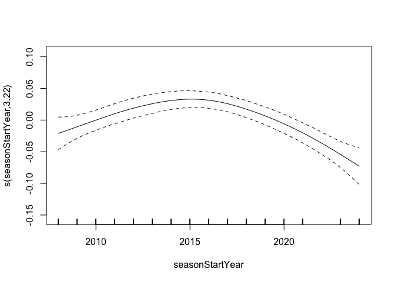<!-- -->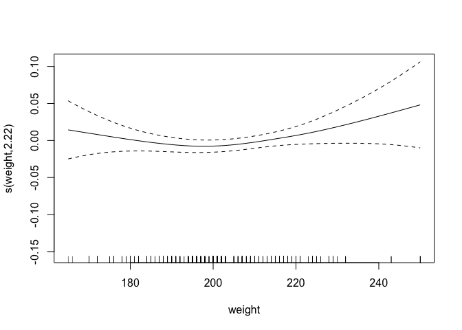<!-- -->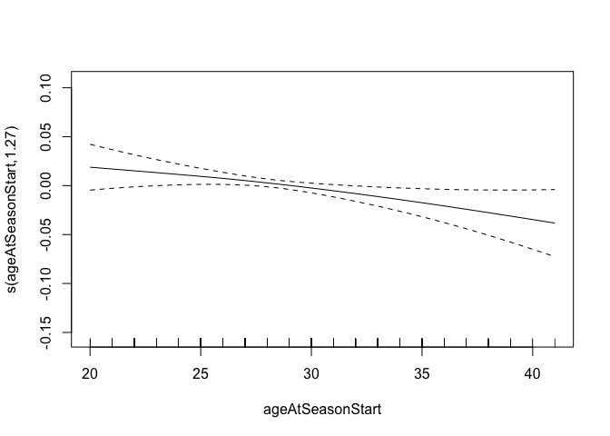<!-- -->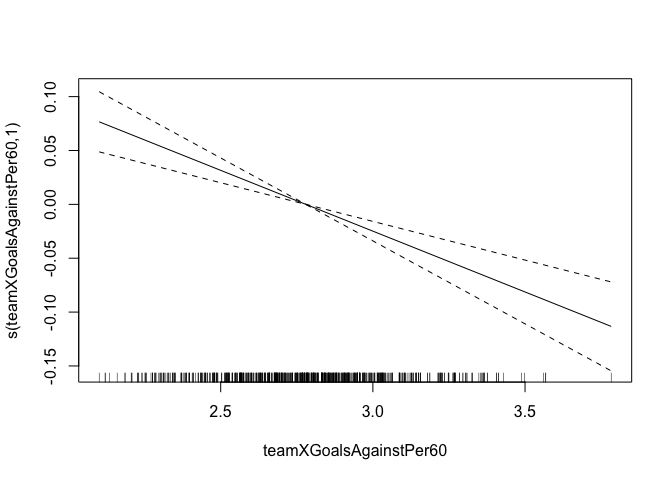<!-- -->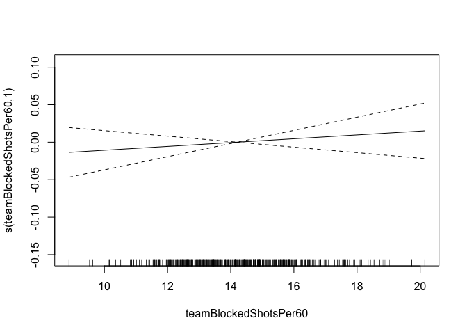<!-- --><!-- -->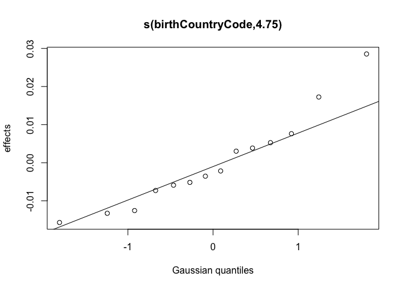<!-- -->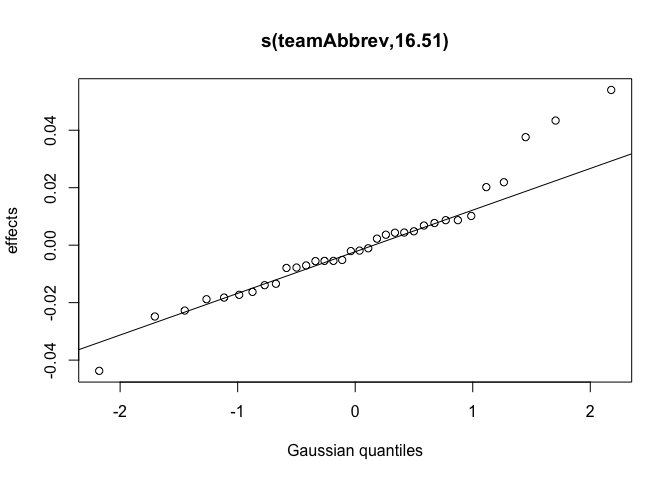<!-- -->

``` r
# Check diagnostics for SV% GAM with undersized
gam.check(savePct_gam2)
```

<!-- -->

    ## 
    ## Method: ML   Optimizer: outer newton
    ## full convergence after 12 iterations.
    ## Gradient range [-0.0003896624,0.0004066905]
    ## (score -2454.699 & scale 1).
    ## Hessian positive definite, eigenvalue range [0.0002460978,363.9805].
    ## Model rank =  155 / 155 
    ## 
    ## Basis dimension (k) checking results. Low p-value (k-index<1) may
    ## indicate that k is too low, especially if edf is close to k'.
    ## 
    ##                               k'   edf k-index p-value  
    ## s(seasonStartYear)          9.00  3.22    1.02   0.680  
    ## s(weight)                  19.00  2.22    0.96   0.040 *
    ## s(ageAtSeasonStart)        19.00  1.27    1.02   0.665  
    ## s(teamXGoalsAgainstPer60)  19.00  1.00    0.97   0.120  
    ## s(teamBlockedShotsPer60)   19.00  1.00    0.94   0.055 .
    ## s(teamDZoneGiveawaysPer60) 19.00  1.00    0.99   0.365  
    ## s(birthCountryCode)        14.00  4.75      NA      NA  
    ## s(teamAbbrev)              34.00 16.51      NA      NA  
    ## ---
    ## Signif. codes:  0 '***' 0.001 '**' 0.01 '*' 0.05 '.' 0.1 ' ' 1

``` r
# Fit a GAM for GAA using undersized
gaa_gam2 = gam(
  goalsAgainstAverage ~ 
    s(seasonStartYear, bs="cr", k=10) 
  + undersized 
  + s(weight, bs="cr", k=20) 
  + s(ageAtSeasonStart, bs="cr", k=20)
  + s(teamXGoalsAgainstPer60, bs="cr", k=20) 
  + s(teamBlockedShotsPer60, bs="cr", k=20) 
  + s(teamDZoneGiveawaysPer60, bs="cr", k=20) 
  + s(birthCountryCode, bs="re") 
  + s(teamAbbrev, bs="re") 
  + catches,
  data = established_goalies,
  method = "ML",
  family = Gamma(link = "log")
)

summary(gaa_gam2)
```

    ## 
    ## Family: Gamma 
    ## Link function: log 
    ## 
    ## Formula:
    ## goalsAgainstAverage ~ s(seasonStartYear, bs = "cr", k = 10) + 
    ##     undersized + s(weight, bs = "cr", k = 20) + s(ageAtSeasonStart, 
    ##     bs = "cr", k = 20) + s(teamXGoalsAgainstPer60, bs = "cr", 
    ##     k = 20) + s(teamBlockedShotsPer60, bs = "cr", k = 20) + s(teamDZoneGiveawaysPer60, 
    ##     bs = "cr", k = 20) + s(birthCountryCode, bs = "re") + s(teamAbbrev, 
    ##     bs = "re") + catches
    ## 
    ## Parametric coefficients:
    ##                Estimate Std. Error t value Pr(>|t|)    
    ## (Intercept)    0.979892   0.008499 115.300   <2e-16 ***
    ## undersizedTRUE 0.004342   0.012484   0.348    0.728    
    ## catchesR       0.014508   0.016556   0.876    0.381    
    ## ---
    ## Signif. codes:  0 '***' 0.001 '**' 0.01 '*' 0.05 '.' 0.1 ' ' 1
    ## 
    ## Approximate significance of smooth terms:
    ##                               edf Ref.df       F  p-value    
    ## s(seasonStartYear)          4.822  5.837   4.450 0.000211 ***
    ## s(weight)                   1.000  1.000   0.216 0.642230    
    ## s(ageAtSeasonStart)         1.864  2.361   1.860 0.164222    
    ## s(teamXGoalsAgainstPer60)   1.000  1.000 250.190  < 2e-16 ***
    ## s(teamBlockedShotsPer60)    1.000  1.001   0.305 0.581552    
    ## s(teamDZoneGiveawaysPer60)  1.000  1.000   1.252 0.263627    
    ## s(birthCountryCode)         4.285 13.000   1.332 0.002026 ** 
    ## s(teamAbbrev)              17.194 33.000   1.251 0.000131 ***
    ## ---
    ## Signif. codes:  0 '***' 0.001 '**' 0.01 '*' 0.05 '.' 0.1 ' ' 1
    ## 
    ## R-sq.(adj) =  0.413   Deviance explained =   44%
    ## -ML = 129.14  Scale est. = 0.011194  n = 765

``` r
plot(gaa_gam2)
```

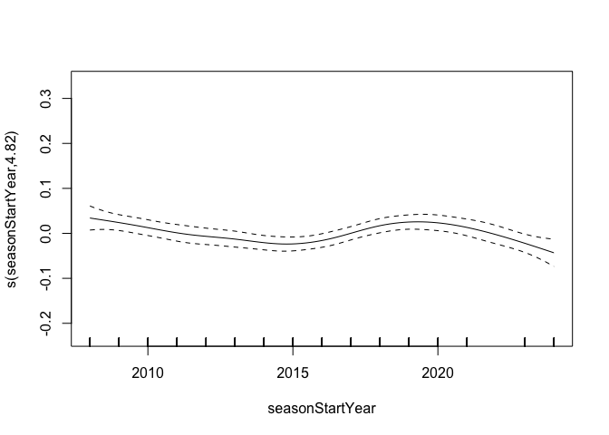<!-- -->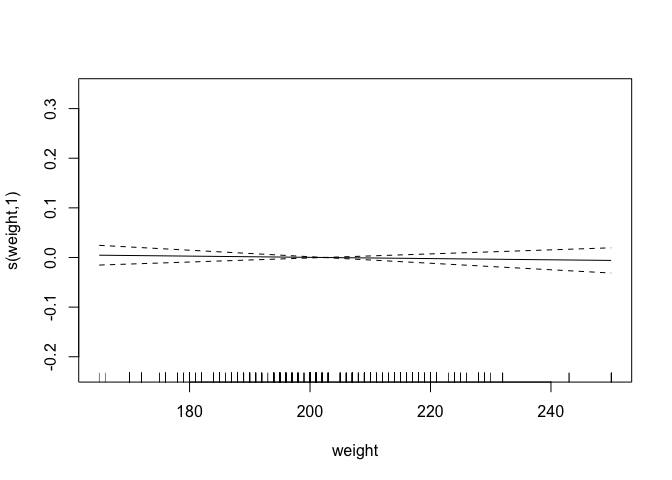<!-- -->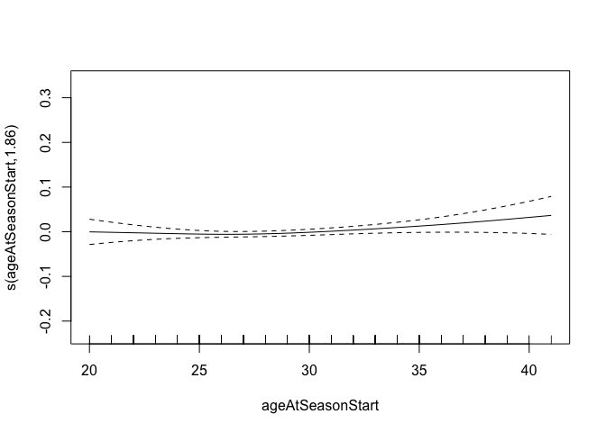<!-- -->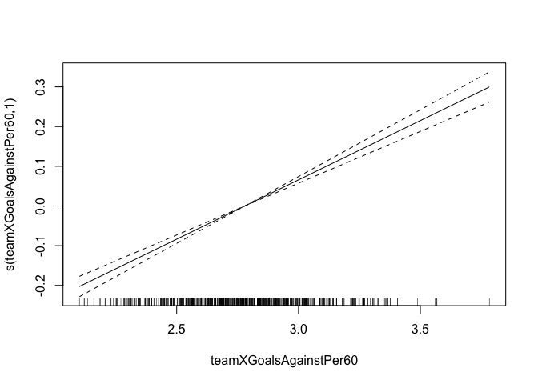<!-- -->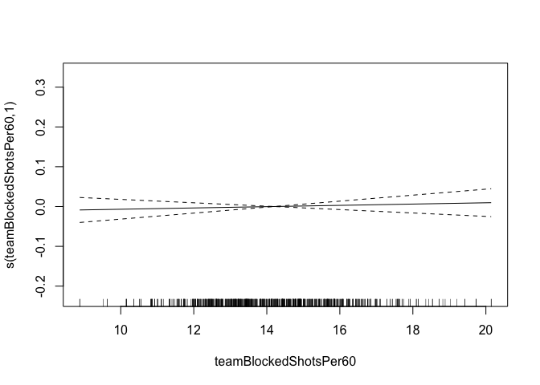<!-- -->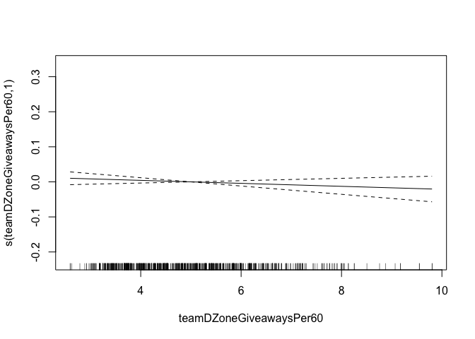<!-- -->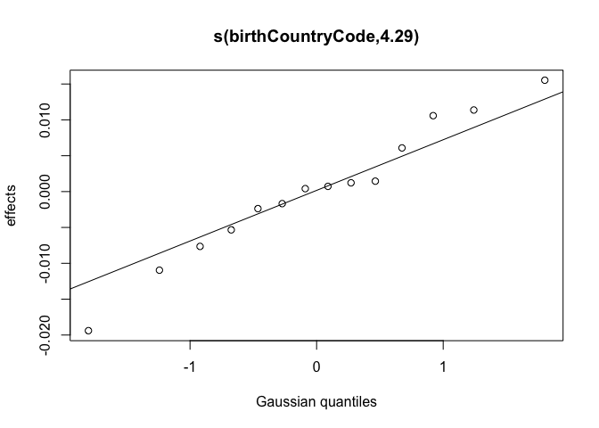<!-- -->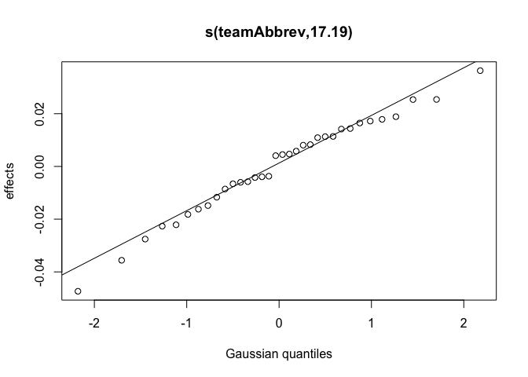<!-- -->

``` r
# Check diagnostics for GAA GAM using undersized
gam.check(gaa_gam2)
```

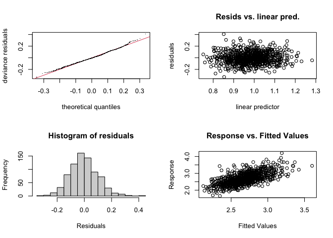<!-- -->

    ## 
    ## Method: ML   Optimizer: outer newton
    ## full convergence after 14 iterations.
    ## Gradient range [-2.300376e-05,0.0001650268]
    ## (score 129.1375 & scale 0.01119372).
    ## Hessian positive definite, eigenvalue range [3.638282e-06,384.126].
    ## Model rank =  155 / 155 
    ## 
    ## Basis dimension (k) checking results. Low p-value (k-index<1) may
    ## indicate that k is too low, especially if edf is close to k'.
    ## 
    ##                               k'   edf k-index p-value
    ## s(seasonStartYear)          9.00  4.82    1.04    0.85
    ## s(weight)                  19.00  1.00    0.99    0.36
    ## s(ageAtSeasonStart)        19.00  1.86    1.01    0.71
    ## s(teamXGoalsAgainstPer60)  19.00  1.00    0.98    0.28
    ## s(teamBlockedShotsPer60)   19.00  1.00    0.97    0.15
    ## s(teamDZoneGiveawaysPer60) 19.00  1.00    0.99    0.40
    ## s(birthCountryCode)        14.00  4.29      NA      NA
    ## s(teamAbbrev)              34.00 17.19      NA      NA

Notice that undersized status is not statistically significant in either
GAM. However, the estimated coefficient of undersized for SV% suggests
shorter goalies have lower SV% while the estimated coefficient of
undersized for GAA suggests shorter goalies have a higher GAA, on
average. The variance of these coefficients show that this is in no way
conclusive however.

## Decision Tree Modelling

``` r
set.seed(42)

# Fit decision tree model for SV% (using height and undersized)
savePct_dt = rpart(
  savePct ~ seasonStartYear + height + undersized + weight + ageAtSeasonStart + teamXGoalsAgainstPer60 + teamBlockedShotsPer60 
          + teamDZoneGiveawaysPer60 + birthCountryCode + teamAbbrev + catches,
  data = established_goalies,
  method = "anova", 
  control = rpart.control(cp = 0.01)
)

# Plot CP table, CV error vs CP, and final tree
printcp(savePct_dt)
```

    ## 
    ## Regression tree:
    ## rpart(formula = savePct ~ seasonStartYear + height + undersized + 
    ##     weight + ageAtSeasonStart + teamXGoalsAgainstPer60 + teamBlockedShotsPer60 + 
    ##     teamDZoneGiveawaysPer60 + birthCountryCode + teamAbbrev + 
    ##     catches, data = established_goalies, method = "anova", control = rpart.control(cp = 0.01))
    ## 
    ## Variables actually used in tree construction:
    ## [1] birthCountryCode       teamAbbrev             teamXGoalsAgainstPer60
    ## 
    ## Root node error: 0.090993/765 = 0.00011894
    ## 
    ## n= 765 
    ## 
    ##         CP nsplit rel error  xerror     xstd
    ## 1 0.081278      0   1.00000 1.00558 0.053089
    ## 2 0.037286      1   0.91872 0.97313 0.051423
    ## 3 0.035963      2   0.88144 1.00947 0.052602
    ## 4 0.016932      3   0.84547 1.01169 0.052233
    ## 5 0.016263      4   0.82854 1.00817 0.052519
    ## 6 0.014110      5   0.81228 1.02341 0.052705
    ## 7 0.012515      6   0.79817 1.03054 0.053284
    ## 8 0.010708      8   0.77314 1.01744 0.053806
    ## 9 0.010000      9   0.76243 1.01791 0.053179

``` r
plotcp(savePct_dt)
```

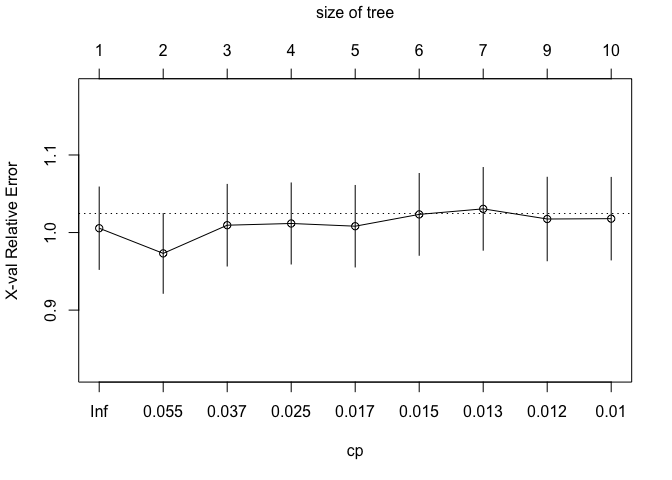<!-- -->

``` r
rpart.plot(savePct_dt, main = "Regression Tree for SV%")
```

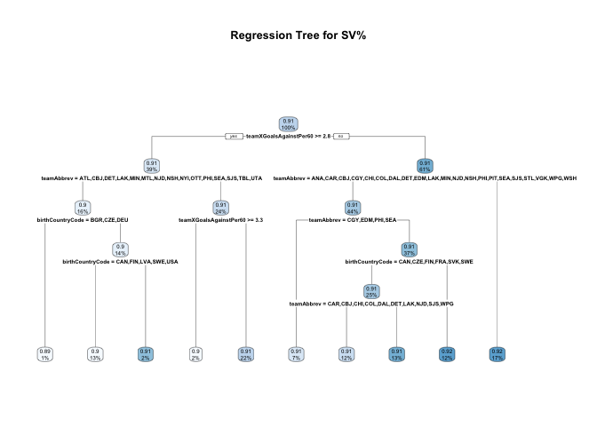<!-- -->

``` r
set.seed(42)

# Fit decision tree model for GAA (using height and undersized)
gaa_dt = rpart(
  goalsAgainstAverage ~ seasonStartYear + height + undersized + weight + ageAtSeasonStart + teamXGoalsAgainstPer60 + teamBlockedShotsPer60 
          + teamDZoneGiveawaysPer60 + birthCountryCode + teamAbbrev + catches,
  data = established_goalies,
  method = "anova", 
  control = rpart.control(cp = 0.01)
)

# Plot CP table, CV error vs CP, and final tree
printcp(gaa_dt)
```

    ## 
    ## Regression tree:
    ## rpart(formula = goalsAgainstAverage ~ seasonStartYear + height + 
    ##     undersized + weight + ageAtSeasonStart + teamXGoalsAgainstPer60 + 
    ##     teamBlockedShotsPer60 + teamDZoneGiveawaysPer60 + birthCountryCode + 
    ##     teamAbbrev + catches, data = established_goalies, method = "anova", 
    ##     control = rpart.control(cp = 0.01))
    ## 
    ## Variables actually used in tree construction:
    ## [1] birthCountryCode       teamAbbrev             teamXGoalsAgainstPer60
    ## 
    ## Root node error: 104.28/765 = 0.13632
    ## 
    ## n= 765 
    ## 
    ##         CP nsplit rel error  xerror     xstd
    ## 1 0.256476      0   1.00000 1.00466 0.055207
    ## 2 0.049934      1   0.74352 0.77025 0.045130
    ## 3 0.031667      2   0.69359 0.73403 0.041404
    ## 4 0.029068      3   0.66192 0.77549 0.043030
    ## 5 0.027548      4   0.63285 0.77484 0.041636
    ## 6 0.012175      5   0.60531 0.75259 0.040641
    ## 7 0.011680      6   0.59313 0.76951 0.041451
    ## 8 0.010000      7   0.58145 0.77031 0.041973

``` r
plotcp(gaa_dt)
```

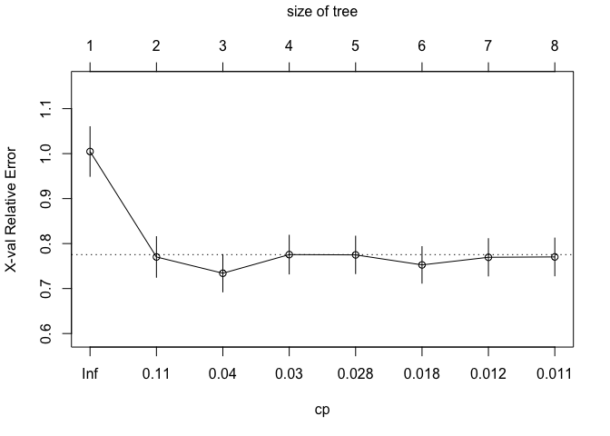<!-- -->

``` r
rpart.plot(gaa_dt, main = "Regression Tree for GAA")
```

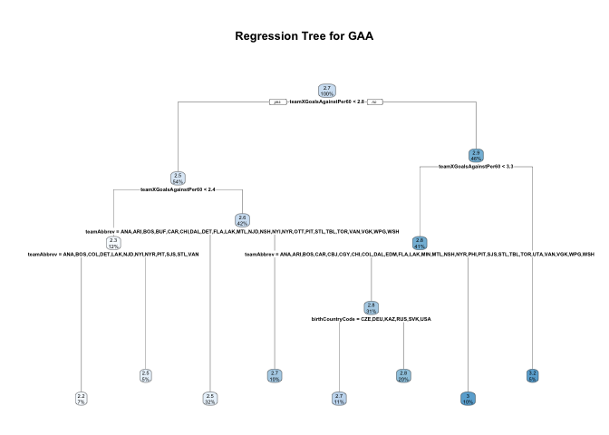<!-- -->

Notice that neither height or undersized status gets used in any of the
regression trees, indicating that is not a relevant predictor to SV% or
GAA.

## Random Forest Modelling

``` r
set.seed(42)

# Fit RF model for SV% using height
savePct_rf = randomForest(
  savePct ~ seasonStartYear + height + weight + ageAtSeasonStart + teamXGoalsAgainstPer60 + teamBlockedShotsPer60 
          + teamDZoneGiveawaysPer60 + birthCountryCode + teamAbbrev + catches,
  data = established_goalies,
  importance = TRUE)

savePct_rf
```

    ## 
    ## Call:
    ##  randomForest(formula = savePct ~ seasonStartYear + height + weight +      ageAtSeasonStart + teamXGoalsAgainstPer60 + teamBlockedShotsPer60 +      teamDZoneGiveawaysPer60 + birthCountryCode + teamAbbrev +      catches, data = established_goalies, importance = TRUE) 
    ##                Type of random forest: regression
    ##                      Number of trees: 500
    ## No. of variables tried at each split: 3
    ## 
    ##           Mean of squared residuals: 9.871289e-05
    ##                     % Var explained: 17.01

``` r
# Plot variable importance for SV% RF using height
varImpPlot(savePct_rf, main = "Variable Importance Plots of SV% Random Forest Model (w/ Height)")
```

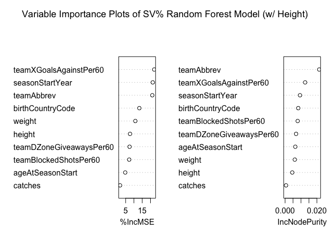<!-- -->

``` r
importance(savePct_rf) |>
  as.data.frame() |>
  rownames_to_column(var = "Variable") |>
  arrange(desc(`%IncMSE`))
```

    ##                   Variable   %IncMSE IncNodePurity
    ## 1   teamXGoalsAgainstPer60 22.240285   0.012598025
    ## 2          seasonStartYear 21.372579   0.009375545
    ## 3               teamAbbrev 21.080935   0.021453499
    ## 4         birthCountryCode 13.264285   0.008270551
    ## 5                   weight 10.839731   0.006114244
    ## 6                   height  7.653012   0.004504520
    ## 7  teamDZoneGiveawaysPer60  7.376831   0.006919735
    ## 8    teamBlockedShotsPer60  7.143536   0.007912293
    ## 9         ageAtSeasonStart  4.754529   0.006419229
    ## 10                 catches  1.650327   0.000611284

``` r
# Extract the effect of height in the SV% RF
partial(savePct_rf, pred.var = "height", plot = TRUE)
```

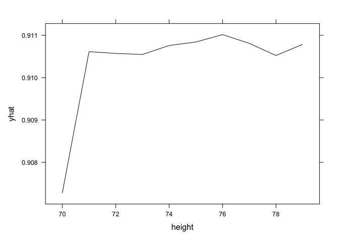<!-- -->

``` r
set.seed(42)

# Fit RF model for GAA using height
gaa_rf = randomForest(
  goalsAgainstAverage ~ seasonStartYear + height + weight + ageAtSeasonStart + teamXGoalsAgainstPer60 + teamBlockedShotsPer60 
          + teamDZoneGiveawaysPer60 + birthCountryCode + teamAbbrev + catches,
  data = established_goalies,
  importance = TRUE)

gaa_rf
```

    ## 
    ## Call:
    ##  randomForest(formula = goalsAgainstAverage ~ seasonStartYear +      height + weight + ageAtSeasonStart + teamXGoalsAgainstPer60 +      teamBlockedShotsPer60 + teamDZoneGiveawaysPer60 + birthCountryCode +      teamAbbrev + catches, data = established_goalies, importance = TRUE) 
    ##                Type of random forest: regression
    ##                      Number of trees: 500
    ## No. of variables tried at each split: 3
    ## 
    ##           Mean of squared residuals: 0.08798583
    ##                     % Var explained: 35.46

``` r
# Plot variable importance for GAA RF using height
varImpPlot(gaa_rf, main = "Variable Importance Plots of GAA Random Forest Model (w/ Height)")
```

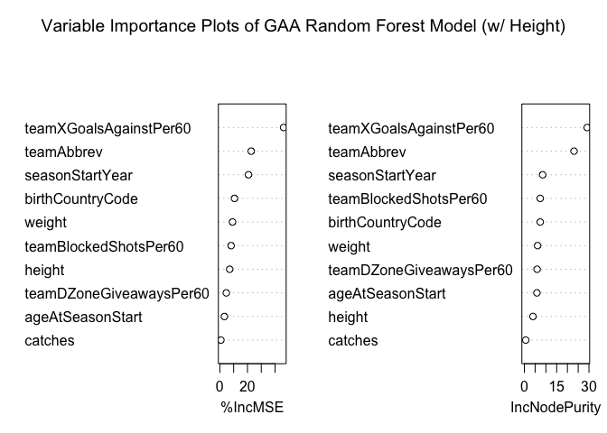<!-- -->

``` r
importance(gaa_rf) |>
  as.data.frame() |>
  rownames_to_column(var = "Variable") |>
  arrange(desc(`%IncMSE`))
```

    ##                   Variable   %IncMSE IncNodePurity
    ## 1   teamXGoalsAgainstPer60 46.210710    29.1537612
    ## 2               teamAbbrev 22.729221    23.0659420
    ## 3          seasonStartYear 20.748142     8.4861192
    ## 4         birthCountryCode 10.611164     7.3519548
    ## 5                   weight  9.198025     6.1448196
    ## 6    teamBlockedShotsPer60  8.168180     7.3576914
    ## 7                   height  7.138220     3.9880184
    ## 8  teamDZoneGiveawaysPer60  4.671174     5.9202798
    ## 9         ageAtSeasonStart  3.307344     5.8291679
    ## 10                 catches  0.742054     0.6381632

``` r
# Extract the effect of height in the GAA RF
partial(gaa_rf, pred.var = "height", plot = TRUE)
```

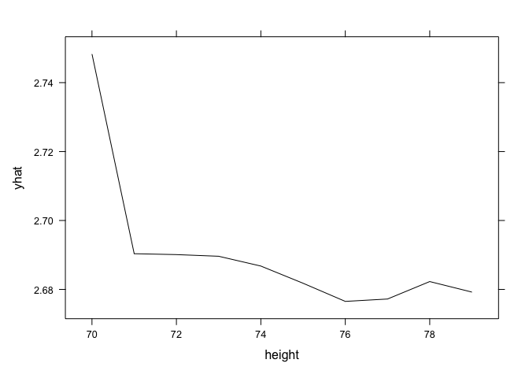<!-- -->

Notice that both the SV% and GAA random forest models perform worse than
the GAM in terms of variance explained. Similar to the GAMs, height is
not an important variable in an already weak model. Also like the gams,
however, it appears the shortest of goalies have worse SV% and GAA than
taller goalies.

``` r
set.seed(42)

# Fit RF model for SV% using undersized
savePct_rf2 = randomForest(
  savePct ~ seasonStartYear + undersized + weight + ageAtSeasonStart + teamXGoalsAgainstPer60 + teamBlockedShotsPer60 
          + teamDZoneGiveawaysPer60 + birthCountryCode + teamAbbrev + catches,
  data = established_goalies,
  importance = TRUE)

savePct_rf2
```

    ## 
    ## Call:
    ##  randomForest(formula = savePct ~ seasonStartYear + undersized +      weight + ageAtSeasonStart + teamXGoalsAgainstPer60 + teamBlockedShotsPer60 +      teamDZoneGiveawaysPer60 + birthCountryCode + teamAbbrev +      catches, data = established_goalies, importance = TRUE) 
    ##                Type of random forest: regression
    ##                      Number of trees: 500
    ## No. of variables tried at each split: 3
    ## 
    ##           Mean of squared residuals: 0.0001001335
    ##                     % Var explained: 15.82

``` r
# Plot variable importance for SV% RF using undersized status
varImpPlot(savePct_rf2, main = "Variable Importance Plots of SV% Random Forest Model (w/ Undersized)")
```

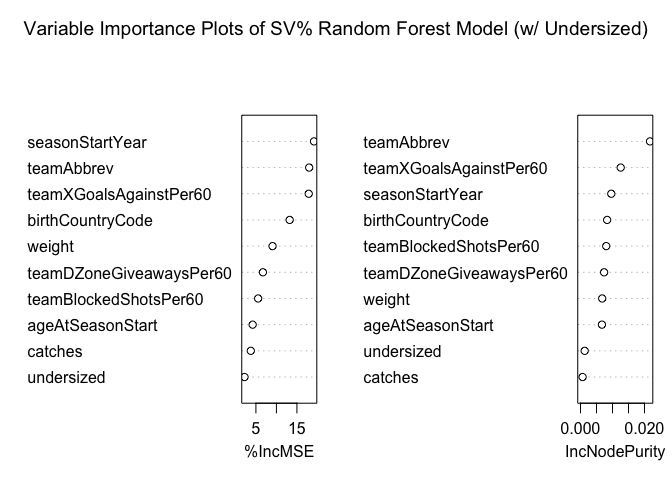<!-- -->

``` r
importance(savePct_rf2) |>
  as.data.frame() |>
  rownames_to_column(var = "Variable") |>
  arrange(desc(`%IncMSE`))
```

    ##                   Variable   %IncMSE IncNodePurity
    ## 1          seasonStartYear 19.172006  0.0096166565
    ## 2               teamAbbrev 17.991901  0.0217328327
    ## 3   teamXGoalsAgainstPer60 17.878684  0.0125605464
    ## 4         birthCountryCode 13.231796  0.0083173680
    ## 5                   weight  9.059573  0.0067809201
    ## 6  teamDZoneGiveawaysPer60  6.709960  0.0073737664
    ## 7    teamBlockedShotsPer60  5.543850  0.0080385262
    ## 8         ageAtSeasonStart  4.209160  0.0066991805
    ## 9                  catches  3.754359  0.0006499772
    ## 10              undersized  2.222845  0.0013033837

``` r
# Extract the effect of undersized status in the SV% RF
partial(savePct_rf2, pred.var = "undersized", plot = TRUE)
```

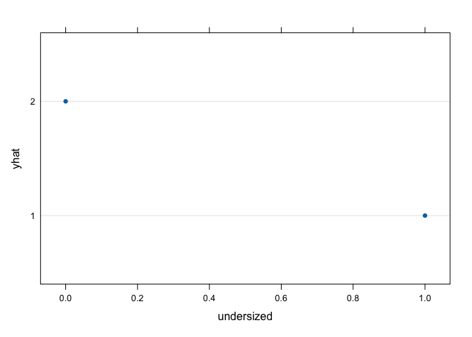<!-- -->

``` r
set.seed(42)

# Fit RF model for GAA using undersized
gaa_rf2 = randomForest(
  goalsAgainstAverage ~ seasonStartYear + undersized + weight + ageAtSeasonStart + teamXGoalsAgainstPer60 + teamBlockedShotsPer60 
          + teamDZoneGiveawaysPer60 + birthCountryCode + teamAbbrev + catches,
  data = established_goalies,
  importance = TRUE)

gaa_rf2
```

    ## 
    ## Call:
    ##  randomForest(formula = goalsAgainstAverage ~ seasonStartYear +      undersized + weight + ageAtSeasonStart + teamXGoalsAgainstPer60 +      teamBlockedShotsPer60 + teamDZoneGiveawaysPer60 + birthCountryCode +      teamAbbrev + catches, data = established_goalies, importance = TRUE) 
    ##                Type of random forest: regression
    ##                      Number of trees: 500
    ## No. of variables tried at each split: 3
    ## 
    ##           Mean of squared residuals: 0.08803049
    ##                     % Var explained: 35.42

``` r
# Plot variable importance for GAA RF using undersized status
varImpPlot(gaa_rf2, main = "Variable Importance Plots of GAA Random Forest Model (w/ Undersized)")
```

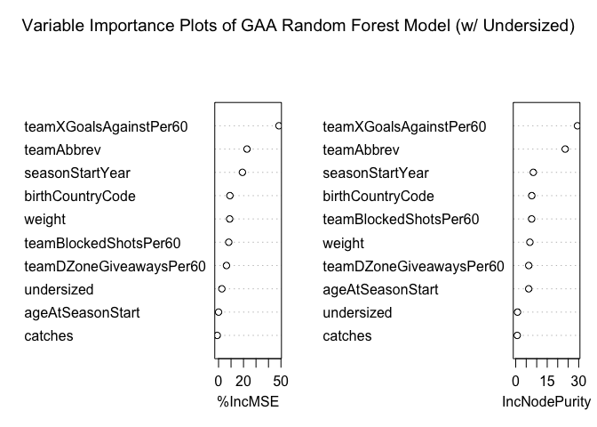<!-- -->

``` r
importance(gaa_rf2) |>
  as.data.frame() |>
  rownames_to_column(var = "Variable") |>
  arrange(desc(`%IncMSE`))
```

    ##                   Variable     %IncMSE IncNodePurity
    ## 1   teamXGoalsAgainstPer60 48.40677586     29.416470
    ## 2               teamAbbrev 22.79424450     23.574982
    ## 3          seasonStartYear 19.14060288      8.365800
    ## 4         birthCountryCode  9.11168388      7.656296
    ## 5                   weight  8.90114071      6.745816
    ## 6    teamBlockedShotsPer60  8.17006344      7.576926
    ## 7  teamDZoneGiveawaysPer60  6.35435283      6.196713
    ## 8               undersized  2.65241775      0.847283
    ## 9         ageAtSeasonStart  0.01202912      6.186019
    ## 10                 catches -1.05775466      0.709676

``` r
# Extract the effect of undersized status in the GAA RF
partial(gaa_rf2, pred.var = "undersized", plot = TRUE)
```

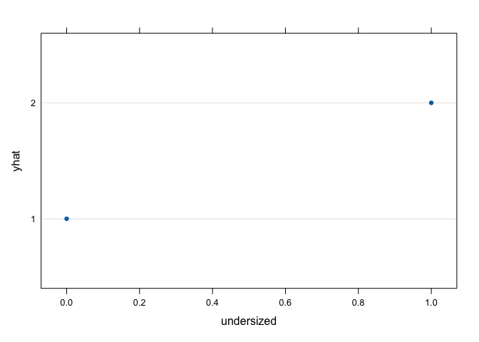<!-- -->

Notice that both the SV% and GAA random forest models using undersized
status perform worse than the GAMs in terms of variance explained.
Similar to the GAMs, undersized status is not an important variable in
an already weak model. Also like the GAMs, however, it appears the
shortest of goalies have worse SV% and GAA than taller goalies.
